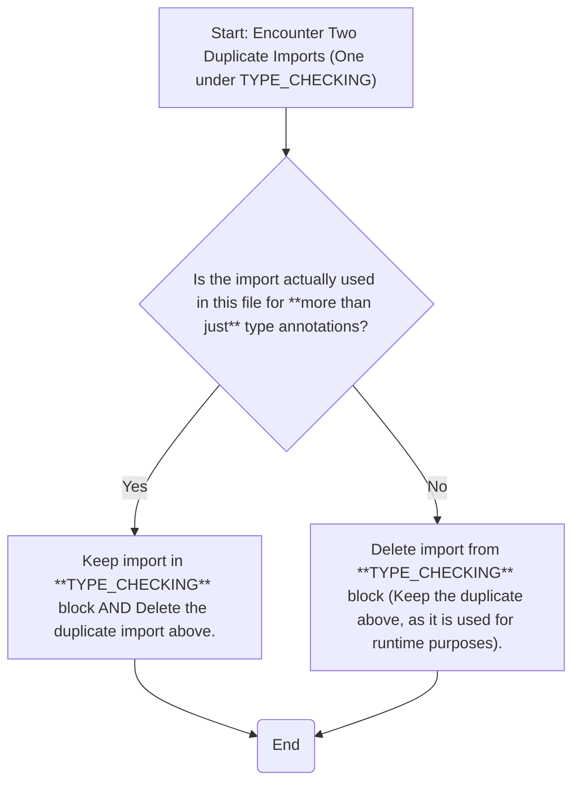

```yaml
number: 21888
title: "Unlike `pyflakes`, which correctly detects the problem, `redefined-while-unused (F811)` does not report duplicate imports when `if TYPE_CHECKING` is used"
type: issue
state: closed
author: alessio-locatelli
labels: []
assignees: []
created_at: 2025-12-10T07:07:01Z
updated_at: 2025-12-10T17:54:52Z
url: https://github.com/astral-sh/ruff/issues/21888
synced_at: 2026-01-12T15:54:58Z
```

# Unlike `pyflakes`, which correctly detects the problem, `redefined-while-unused (F811)` does not report duplicate imports when `if TYPE_CHECKING` is used

---

_@alessio-locatelli_

### Summary

#### MRE

```py
from collections.abc import Iterator
from typing import TYPE_CHECKING

if TYPE_CHECKING:
    from collections.abc import Iterator


def func(_: Iterator[int]): ...
```

#### ruff behavior (it fails to detect the problem)

Command:

```bash
ruff check --select=F --preview mre.py
```

Output:
```
All checks passed!
```

Command:
```bash
ruff check --select=F mre.py
```

Output:
```
All checks passed!
```

#### `pyflakes` (it correctly detects the problem)

Command:
```bash
uvx pyflakes mre.py
```

Output:
```
mre.py:5:5: redefinition of unused 'Iterator' from line 1
```

### Version

0.14.8

### Notes

By the way, running `ruff check --select=ALL --verbose mre.py` on the same code shows:


```
TC004 Move import `collections.abc.Iterator` out of type-checking block. Import is used for more than type hinting.
 --> mre.py:5:33
  |
4 | if TYPE_CHECKING:
5 |     from collections.abc import Iterator
  |                                 ^^^^^^^^
  |
help: Move out of type-checking block
```

which looks like one more bug because `Iterator` in this file is used only for the type hinting. 

Perhaps the logic in both rules should be fixed to follow the workflow:




---

_Comment by @ntBre on 2025-12-10 13:39_

Thanks for the report and for the cool diagram! I think this is a duplicate of https://github.com/astral-sh/ruff/issues/17555.

---

_Closed by @ntBre on 2025-12-10 13:39_

---

_Comment by @alessio-locatelli on 2025-12-10 17:48_

I apologize for creating a duplicate issue; I searched for duplicates using the issue title.

Searching the issue body at https://github.com/search?q=repo%3Aastral-sh%2Fruff%20F811%20is%3Aissue&type=issues yields 85 issues, which is simply impossible to review in an adequate amount of time.

@ntBre, if you have permission to edit the issue title, it would be greatly appreciated if you could include `F811` in the title of this issue: https://github.com/astral-sh/ruff/issues/17555. Perhaps this may help other people find an issue that is relevant to specific rule(s).

---

_Comment by @ntBre on 2025-12-10 17:54_

No worries, the search can be a bit unreliable. I only knew because I'd seen the other issue before, and I guess searching for `f811 type_checking` got me there faster. I'll update the title.

---
