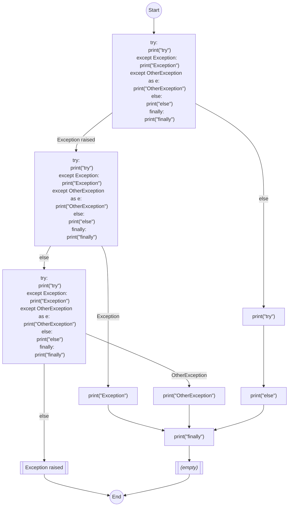

```yaml
number: 10891
title: "[`pylint`] Re-implement `unreachable` (`PLW0101`)"
type: pull_request
state: merged
author: augustelalande
labels:
  - rule
  - preview
assignees: []
merged: true
base: main
head: unreachable
created_at: 2024-04-11T22:36:41Z
updated_at: 2025-01-03T05:20:43Z
url: https://github.com/astral-sh/ruff/pull/10891
synced_at: 2026-01-10T20:42:26Z
```

# [`pylint`] Re-implement `unreachable` (`PLW0101`)

---

_Pull request opened by @augustelalande on 2024-04-11 22:36_

## Summary

This PR re-introduces the control-flow graph implementation which was first introduced in #5384, and then removed in #9463 due to not being feature complete. Mainly, it lacked the ability to process `try`-`except` blocks, along with some more minor bugs.

Closes #8958 and #8959 and #14881.

## Overview of Changes

I will now highlight the major changes implemented in this PR, in order of implementation.

1. Introduced a post-processing step in loop handling to find any `continue` or `break` statements within the loop body and redirect them appropriately.
2. Introduced a loop-continue block which is always placed at the end of loop blocks, and ensures proper looping regardless of the internal logic of the block. This resolves #8958.
3. Implemented `try` processing with the following logic (resolves #8959):
    1. In the example below the cfg first encounters a conditional `ExceptionRaised` forking if an exception was (or will be) raised in the try block. This is not possible to know (except for trivial cases) so we assume both paths can be taken unconditionally.
    2. Going down the `try` path the cfg goes `try`->`else`->`finally` unconditionally.
    3. Going down the `except` path the cfg will meet several conditional `ExceptionCaught` which fork depending on the nature of the exception caught. Again there's no way to know which exceptions may be raised so both paths are assumed to be taken unconditionally.
    4. If none of the exception blocks catch the exception then the cfg terminates by raising a new exception.
    5. A post-processing step is also implemented to redirect any `raises` or `returns` within the blocks appropriately.
```python
def func():
    try:
        print("try")
    except Exception:
        print("Exception")
    except OtherException as e:
        print("OtherException")
    else:
        print("else")
    finally:
        print("finally")
```

6. Implemented `with` processing with the following logic:
    1. `with` statements have no conditional execution (apart from the hidden logic handling the enter and exit), so the block is assumed to execute unconditionally.
    2. The one exception is that exceptions raised within the block may result in control flow resuming at the end of the block. Since it is not possible know if an exception will be raised, or if it will be handled by the context manager, we assume that execution always continues after `with` blocks even if the blocks contain `raise` or `return` statements. This is handled in a post-processing step.

## Test Plan

Additional test fixtures and control-flow fixtures were added.


---

_Comment by @github-actions[bot] on 2024-04-11 22:56_

<!-- generated-comment ecosystem -->
## `ruff-ecosystem` results
### Linter (stable)
✅ ecosystem check detected no linter changes.

### Linter (preview)
ℹ️ ecosystem check **detected linter changes**. (+21 -0 violations, +0 -0 fixes in 6 projects; 49 projects unchanged)

<details><summary><a href="https://github.com/apache/airflow">apache/airflow</a> (+14 -0 violations, +0 -0 fixes)</summary>
<p>
<pre>ruff check --no-cache --exit-zero --ignore RUF9 --output-format concise --preview --select ALL</pre>
</p>
<p>

<pre>
+ <a href='https://github.com/apache/airflow/blob/83604a0c7b7762dff97076554c7dc35ee4e8cf85/airflow/triggers/base.py#L102'>airflow/triggers/base.py:102:9:</a> PLW0101 Unreachable code in `run`
+ <a href='https://github.com/apache/airflow/blob/83604a0c7b7762dff97076554c7dc35ee4e8cf85/airflow/triggers/testing.py#L52'>airflow/triggers/testing.py:52:13:</a> PLW0101 Unreachable code in `run`
+ <a href='https://github.com/apache/airflow/blob/83604a0c7b7762dff97076554c7dc35ee4e8cf85/dev/example_dags/update_example_dags_paths.py#L50'>dev/example_dags/update_example_dags_paths.py:50:5:</a> PLW0101 Unreachable code in `check_if_url_exists`
+ <a href='https://github.com/apache/airflow/blob/83604a0c7b7762dff97076554c7dc35ee4e8cf85/tests/models/test_baseoperator.py#L754'>tests/models/test_baseoperator.py:754:21:</a> PLW0101 Unreachable code in `my_work`
+ <a href='https://github.com/apache/airflow/blob/83604a0c7b7762dff97076554c7dc35ee4e8cf85/tests/models/test_mappedoperator.py#L1065'>tests/models/test_mappedoperator.py:1065:21:</a> PLW0101 Unreachable code in `other_setup`
+ <a href='https://github.com/apache/airflow/blob/83604a0c7b7762dff97076554c7dc35ee4e8cf85/tests/models/test_mappedoperator.py#L1081'>tests/models/test_mappedoperator.py:1081:21:</a> PLW0101 Unreachable code in `my_setup`
+ <a href='https://github.com/apache/airflow/blob/83604a0c7b7762dff97076554c7dc35ee4e8cf85/tests/models/test_mappedoperator.py#L1107'>tests/models/test_mappedoperator.py:1107:21:</a> PLW0101 Unreachable code in `other_setup`
+ <a href='https://github.com/apache/airflow/blob/83604a0c7b7762dff97076554c7dc35ee4e8cf85/tests/models/test_mappedoperator.py#L1280'>tests/models/test_mappedoperator.py:1280:21:</a> PLW0101 Unreachable code in `my_work`
+ <a href='https://github.com/apache/airflow/blob/83604a0c7b7762dff97076554c7dc35ee4e8cf85/tests/models/test_mappedoperator.py#L1297'>tests/models/test_mappedoperator.py:1297:21:</a> PLW0101 Unreachable code in `my_work`
+ <a href='https://github.com/apache/airflow/blob/83604a0c7b7762dff97076554c7dc35ee4e8cf85/tests/models/test_mappedoperator.py#L1599'>tests/models/test_mappedoperator.py:1599:17:</a> PLW0101 Unreachable code in `my_work`
+ <a href='https://github.com/apache/airflow/blob/83604a0c7b7762dff97076554c7dc35ee4e8cf85/tests/models/test_mappedoperator.py#L1637'>tests/models/test_mappedoperator.py:1637:25:</a> PLW0101 Unreachable code in `my_work`
+ <a href='https://github.com/apache/airflow/blob/83604a0c7b7762dff97076554c7dc35ee4e8cf85/tests/models/test_mappedoperator.py#L1684'>tests/models/test_mappedoperator.py:1684:25:</a> PLW0101 Unreachable code in `my_work`
+ <a href='https://github.com/apache/airflow/blob/83604a0c7b7762dff97076554c7dc35ee4e8cf85/tests/models/test_mappedoperator.py#L994'>tests/models/test_mappedoperator.py:994:21:</a> PLW0101 Unreachable code in `my_setup`
+ <a href='https://github.com/apache/airflow/blob/83604a0c7b7762dff97076554c7dc35ee4e8cf85/tests/models/test_taskinstance.py#L3454'>tests/models/test_taskinstance.py:3454:13:</a> PLW0101 Unreachable code in `on_finish_callable`
</pre>

</p>
</details>
<details><summary><a href="https://github.com/freedomofpress/securedrop">freedomofpress/securedrop</a> (+1 -0 violations, +0 -0 fixes)</summary>
<p>
<pre>ruff check --no-cache --exit-zero --ignore RUF9 --output-format concise --preview</pre>
</p>
<p>

<pre>
+ <a href='https://github.com/freedomofpress/securedrop/blob/760148440271d4b9bdca5ce97ab0e511f9c8d8f2/admin/securedrop_admin/__init__.py#L78'>admin/securedrop_admin/__init__.py:78:5:</a> PLW0101 Unreachable code in `openssh_version`
</pre>

</p>
</details>
<details><summary><a href="https://github.com/latchbio/latch">latchbio/latch</a> (+1 -0 violations, +0 -0 fixes)</summary>
<p>
<pre>ruff check --no-cache --exit-zero --ignore RUF9 --output-format concise --preview</pre>
</p>
<p>

<pre>
+ <a href='https://github.com/latchbio/latch/blob/f986b146bce5cd9d915721edaf608d84c53d8648/src/latch_cli/snakemake/single_task_snakemake.py#L236'>src/latch_cli/snakemake/single_task_snakemake.py:236:5:</a> PLW0101 Unreachable code in `empty_generator`
</pre>

</p>
</details>
<details><summary><a href="https://github.com/pandas-dev/pandas">pandas-dev/pandas</a> (+1 -0 violations, +0 -0 fixes)</summary>
<p>
<pre>ruff check --no-cache --exit-zero --ignore RUF9 --output-format concise --preview</pre>
</p>
<p>

<pre>
+ <a href='https://github.com/pandas-dev/pandas/blob/5e50d3f3d2b0ee65f0d5bfda0c6da47ffd39dcfe/pandas/io/parsers/python_parser.py#L1316'>pandas/io/parsers/python_parser.py:1316:25:</a> PLW0101 Unreachable code in `_get_lines`
</pre>

</p>
</details>
<details><summary><a href="https://github.com/pytest-dev/pytest">pytest-dev/pytest</a> (+3 -0 violations, +0 -0 fixes)</summary>
<p>
<pre>ruff check --no-cache --exit-zero --ignore RUF9 --output-format concise --preview</pre>
</p>
<p>

<pre>
+ <a href='https://github.com/pytest-dev/pytest/blob/e8c2082d751999fa0ebf1ba335cfec3b022f0a88/src/_pytest/config/__init__.py#L1842'>src/_pytest/config/__init__.py:1842:9:</a> PLW0101 Unreachable code in `_assertion_supported`
+ <a href='https://github.com/pytest-dev/pytest/blob/e8c2082d751999fa0ebf1ba335cfec3b022f0a88/testing/code/test_code.py#L151'>testing/code/test_code.py:151:17:</a> PLW0101 Unreachable code in `test_bad_getsource`
+ <a href='https://github.com/pytest-dev/pytest/blob/e8c2082d751999fa0ebf1ba335cfec3b022f0a88/testing/code/test_code.py#L167'>testing/code/test_code.py:167:17:</a> PLW0101 Unreachable code in `test_getsource`
</pre>

</p>
</details>
<details><summary><a href="https://github.com/astropy/astropy">astropy/astropy</a> (+1 -0 violations, +0 -0 fixes)</summary>
<p>
<pre>ruff check --no-cache --exit-zero --ignore RUF9 --output-format concise --preview</pre>
</p>
<p>

<pre>
+ <a href='https://github.com/astropy/astropy/blob/80aa67d2cc7ddb41a63d00d231b2792aafca77fa/astropy/table/tests/test_bst.py#L18'>astropy/table/tests/test_bst.py:18:5:</a> PLW0101 Unreachable code in `tree`
</pre>

</p>
</details>
<details><summary>Changes by rule (1 rules affected)</summary>
<p>

| code | total | + violation | - violation | + fix | - fix |
| ---- | ------- | --------- | -------- | ----- | ---- |
| PLW0101 | 21 | 21 | 0 | 0 | 0 |

</p>
</details>

### Formatter (stable)
✅ ecosystem check detected no format changes.

### Formatter (preview)
✅ ecosystem check detected no format changes.


---

_Comment by @charliermarsh on 2024-04-11 23:05_

Nice, I'm a fan of this.

---

_Comment by @augustelalande on 2024-04-11 23:25_

No promises, just started taking a look at it.

---

_Comment by @augustelalande on 2024-04-11 23:26_

Can you give me some background on why this was never activated? Was there just too many false positives?

---

_Comment by @charliermarsh on 2024-04-12 00:34_

No, I think it's fairly reliable, but I believe `try`-`except` handling wasn't quite finished: https://github.com/astral-sh/ruff/issues/8959. There's also at least one bug to fix: https://github.com/astral-sh/ruff/issues/8958.

---

_Comment by @codspeed-hq[bot] on 2024-04-16 00:06_

## [CodSpeed Performance Report](https://codspeed.io/astral-sh/ruff/branches/augustelalande%3Aunreachable)

### Merging #10891 will **not alter performance**

<sub>Comparing <code>augustelalande:unreachable</code> (d13ff6a) with <code>main</code> (2355472)</sub>


### Summary

`✅ 32` untouched benchmarks  


---

_Marked ready for review by @augustelalande on 2024-04-27 21:29_

---

_Comment by @augustelalande on 2024-04-27 21:30_

This is probably not completely ready for merging, but considering the size it's probably worth getting some feedback now. All the ecosystem checks seem like true positives, there might still be some false negatives, but those will be harder to find.

---

_Comment by @augustelalande on 2024-05-09 04:52_

@charliermarsh when you get the time please have a look at this

---

_Assigned to @MichaReiser by @MichaReiser on 2024-08-01 20:49_

---

_Comment by @MichaReiser on 2024-08-01 20:51_

Sorry for the emberassing long wait. I make this a priority for next week. 

The best way to review this change is probably to compare all changes starting *after* the "Revert" commit. If you have any other review recommendations, let me know :)

---

_Review requested from @MichaReiser by @MichaReiser on 2024-08-01 20:52_

---

_Comment by @augustelalande on 2024-08-01 21:29_

@MichaReiser no worries. Ya that's a good strategy, but also take a look at my PR summary at the top, I tried to give an outline of the changes I made.

---

_Comment by @MichaReiser on 2024-08-05 10:27_

I rebased the commit onto main

---

_Review comment by @MichaReiser on `crates/ruff_linter/src/checkers/ast/analyze/statement.rs`:373 on 2024-08-05 10:28_

Definitely something that we can do as its PR, but are there any inherent constraints that prevent the rule from running on the module body or lambda body?

---

_Review comment by @MichaReiser on `crates/ruff_linter/src/rules/ruff/snapshots/ruff_linter__rules__ruff__tests__RUF014_RUF014.py.snap`:24 on 2024-08-05 10:29_

I would find the message easier to read if we put the function name into quotes or backticks
```suggestion
RUF014.py:12:5: RUF014 Unreachable code in `if_always_true`
```

---

_Review comment by @MichaReiser on `crates/ruff_linter/src/rules/ruff/rules/unreachable.rs`:84 on 2024-08-05 10:34_

It would be great if the rule only emitted a single diagnostic if they are all entered by the same block (only) and that *entry* block is unreachable. There's an example in the ecosytem check results for this

+ <a href='https://github.com/apache/airflow/blob/aa5581e30dd38a90855ec6c4671d6ae0086b57af/dev/example_dags/update_example_dags_paths.py#L50'>dev/example_dags/update_example_dags_paths.py:50:5:</a> RUF014 Unreachable code in check_if_url_exists
+ <a href='https://github.com/apache/airflow/blob/aa5581e30dd38a90855ec6c4671d6ae0086b57af/dev/example_dags/update_example_dags_paths.py#L52'>dev/example_dags/update_example_dags_paths.py:52:9:</a> RUF014 Unreachable code in check_if_url_exists
+ <a href='https://github.com/apache/airflow/blob/aa5581e30dd38a90855ec6c4671d6ae0086b57af/dev/example_dags/update_example_dags_paths.py#L53'>dev/example_dags/update_example_dags_paths.py:53:5:</a> RUF014 Unreachable code in check_if_url_exists
+ <a href='https://github.com/apache/airflow/blob/aa5581e30dd38a90855ec6c4671d6ae0086b57af/dev/example_dags/update_example_dags_paths.py#L54'>dev/example_dags/update_example_dags_paths.py:54:9:</a> RUF014 Unreachable code in check_if_url_exists
+ <a href='https://github.com/apache/airflow/blob/aa5581e30dd38a90855ec6c4671d6ae0086b57af/dev/example_dags/update_example_dags_paths.py#L55'>dev/example_dags/update_example_dags_paths.py:55:5:</a> RUF014 Unreachable code in check_if_url_exists

E.g. BiomeJS creates a single diagnostic that spans the entire unreachable code [playground](https://biomejs.dev/playground/?code=CgBmAHUAbgBjAHQAaQBvAG4AIABjAGgAZQBjAGsAXwBpAGYAXwB1AHIAbABfAGUAeABpAHMAdABzACgAdQByAGwAOgAgAHMAdAByACkAOgAgAGIAbwBvAGwAIAB7AAoAIAAgACAAIAByAGUAdAB1AHIAbgAgAFQAcgB1AGUAIAAgAC8ALwAgAHUAbgBjAG8AbQBtAGUAbgB0ACAAdABvACAAYwBoAGUAYwBrACAAVQBSAEwAcwAKACAAIAAgACAAcgBlAHMAcABvAG4AcwBlACAAPQAgAHIAZQBxAHUAZQBzAHQAcwAuAGgAZQBhAGQAKAB1AHIAbAAsACAAYQBsAGwAbwB3AF8AcgBlAGQAaQByAGUAYwB0AHMAPQBUAHIAdQBlACkACgAgACAAIAAgAGkAZgAgACgAcgBlAHMAcABvAG4AcwBlAC4AcwB0AGEAdAB1AHMAXwBjAG8AZABlACAAPQA9ACAAMgAwADAAKQAgAHsACgAgACAAIAAgACAAIAAgACAAcgBlAHQAdQByAG4AIABUAHIAdQBlAAoAIAAgACAAIAB9AAoAIAAgACAAIABpAGYAIAAoAHIAZQBzAHAAbwBuAHMAZQAuAHMAdABhAHQAdQBzAF8AYwBvAGQAZQAgAD0APQAgADQAMAA0ACkAIAB7AAoAIAAgACAAIAAgACAAIAAgAHIAZQB0AHUAcgBuACAARgBhAGwAcwBlAAoAIAAgACAAIAB9AAoAIAAgACAAIABjAG8AbgBzAG8AbABlAC4AcAByAGkAbgB0ACgAYABbAHIAZQBkAF0AVQBuAGUAeABwAGUAYwB0AGUAZAAgAGUAcgByAG8AcgAgAHIAZQBjAGUAaQB2AGUAZAA6ACAAewByAGUAcwBwAG8AbgBzAGUALgBzAHQAYQB0AHUAcwBfAGMAbwBkAGUAfQBbAC8AXQBgACkACgAgACAAIAAgAHIAZQBzAHAAbwBuAHMAZQAuAHIAYQBpAHMAZQBfAGYAbwByAF8AcwB0AGEAdAB1AHMAKAApAAoAfQA%3D)

---

_Review comment by @MichaReiser on `crates/ruff_linter/src/rules/ruff/rules/unreachable.rs`:100 on 2024-08-05 10:38_

I think we can use `div_ceil` instead
```suggestion
        let size = capacity.div_ceil(usize::BITS as usize);
```

---

_Review comment by @MichaReiser on `crates/ruff_linter/src/rules/ruff/rules/unreachable.rs`:135 on 2024-08-05 10:46_

Nit: It took me quiet some time to understand this condition because `index` is once on the left and the other time on the right side of the condition. 
```suggestion
            if index >= self.bits.len() {
                return None;
            }

            if index == self.bits.len() - 1 && shift >= last_max_shift {
                return None;
            }

```

---

_Review comment by @MichaReiser on `crates/ruff_linter/src/rules/ruff/rules/unreachable.rs`:89 on 2024-08-05 10:48_

Nit: I would move the `Bitmap` and its impl block to the end of the file (before tests). It's mostly implementation detail. 

---

_Review comment by @MichaReiser on `crates/ruff_linter/src/rules/ruff/rules/unreachable.rs`:156 on 2024-08-05 10:53_

I assume that improving the inference here is something you plan to do over time? 

I think it would be nice to support some more constructs like equality and inequality, `is` `is not` etc. @charliermarsh does Ruff already have some infrastructure to evalute an expression?

---

_Comment by @MichaReiser on 2024-08-05 11:00_

> [ibis-project/ibis](https://github.com/ibis-project/ibis) (error)

I did attach a debugger and it seems that it overflows in `post_process_try` when analysing `"ibis/ibis/backends/pyspark/__init__.py"`

---

_Review comment by @MichaReiser on `crates/ruff_linter/src/rules/ruff/rules/unreachable.rs`:271 on 2024-08-05 12:13_

Can you tell me more what the meaning of `exit` is in the context of a condition? 

---

_Review comment by @MichaReiser on `crates/ruff_linter/src/rules/ruff/rules/unreachable.rs`:313 on 2024-08-05 12:14_

It's not immediately clear what the expression is. Is it the expected exception? I would find a comment specifiying what the expression is helpful.

---

_Review comment by @MichaReiser on `crates/ruff_linter/src/rules/ruff/rules/unreachable.rs`:272 on 2024-08-05 12:17_

```rust
    /// To keep `NextBlock` simple(r) `NextBlock::If`'s `next` and `orelse`
    /// fields only use `BlockIndex`, which means that they can't terminate
    /// themselves. To support this we insert *empty*/fake blocks before the end
    /// of the function that we can link to.
```

Could we use the same "trick" for exit or is there a specific reason why we deviate from this for `exit`? 

---

_Review comment by @MichaReiser on `crates/ruff_linter/src/rules/ruff/rules/unreachable.rs`:315 on 2024-08-05 12:18_

Nit: I'm leaning towards naming the exception variants `Raise` and `Except`. It's shorter and is closer to the Python syntax (unless there are other cases where they are used)

---

_Review comment by @MichaReiser on `crates/ruff_linter/src/rules/ruff/rules/unreachable.rs`:397 on 2024-08-05 12:22_

I think I would prefer a `kind` field on `BasicBlock` than asserting on the statements. Mainly because I'm worried that it's very easy to access `stmts` and then being confused where those statements come from. The other reason is that the current implementation compares the `stmts` by value instead of by identity (`str::ptr::eq` compares by identity). It is, in theory, possible that a "real" block could compare equal to `EXCEPTION`, e.g. when it is a manual-built tree. 

---

_Review comment by @MichaReiser on `crates/ruff_linter/src/rules/ruff/rules/unreachable.rs`:391 on 2024-08-05 12:28_

```rust
/// For loop blocks, and similar recurring control flows, the end of the
/// body will point to the loop block again (to create the loop). However an
/// oddity here is that this block might contain statements before the loop
/// itself which, of course, won't be executed again.
///
/// For example:
/// ```python
/// i = 0          # block 0
/// while True:    #
///     continue   # block 1
/// ```
/// Will create a connection between block 1 (loop body) and block 0, which
/// includes the `i = 0` statement.
```

Assuming this comment is still correct. What's the reason that `continue` can't link to `block 0`? Should we instead insert a *fake* empty block before every loop (not specific to `continue`) and use it for when reaching the end of the loop or when hitting a `continue`?

---

_Review comment by @MichaReiser on `crates/ruff_linter/src/rules/ruff/rules/unreachable.rs`:412 on 2024-08-05 12:32_

This condition isn't strictly true, at least not when the parser recovers [playground](https://play.ruff.rs/939deecb-6ac6-4b99-a60b-7199e600b23b). We currently aren't running any lint rules if the AST has any syntax errors but we may consider doing it in the future. 

if there's an easy way to correctly recover in case of an empty block, then that would be great (e.g. create an empty block when stmts is empty)

---

_Review comment by @MichaReiser on `crates/ruff_linter/src/rules/ruff/rules/unreachable.rs`:433 on 2024-08-05 12:33_

I think it would be helpful for readers to have a short comment here explaining what this method does and why it is needed.

---

_Review comment by @MichaReiser on `crates/ruff_linter/src/rules/ruff/rules/unreachable.rs`:1007 on 2024-08-05 12:56_

We now have the different post processing steps and this method. What's the difference between the two? 

---

_Review comment by @MichaReiser on `crates/ruff_linter/src/rules/ruff/rules/snapshots/ruff_linter__rules__ruff__rules__unreachable__tests__try.py.md.snap`:473 on 2024-08-05 13:06_

We should add some tests where we raise exceptions inside blocks other than `try`. E.g.

```python
try:
    assert False
except ex:
    raise ex

finally:
    raise Exception("other")
```

Ideally we combine this with a nested `try` block.

---

_Review comment by @MichaReiser on `crates/ruff_linter/src/rules/ruff/rules/snapshots/ruff_linter__rules__ruff__rules__unreachable__tests__for.py.md.snap`:369 on 2024-08-05 13:07_

Let's add an example with a nested loop where both the outer and inner loop use break/continue.

---

_@MichaReiser reviewed on 2024-08-05 13:09_

Nice work and I'm impressed how little this affects performance. 

I started reviewing the PR but I get the impression that I don't fully understand why the post processing is necessary and why we need the two new sentinel nodes. Could you expand a bit on what the problem is that they solve? 

---

_@augustelalande reviewed on 2024-08-26 00:43_

---

_Review comment by @augustelalande on `crates/ruff_linter/src/checkers/ast/analyze/statement.rs`:373 on 2024-08-26 00:43_

Well lambda body doesn't make sense since it can only be a single statement. But module body can definitely be added.

---

_@augustelalande reviewed on 2024-09-05 02:39_

---

_Review comment by @augustelalande on `crates/ruff_linter/src/rules/ruff/rules/unreachable.rs`:156 on 2024-09-05 02:39_

Certainly

---

_@augustelalande reviewed on 2024-09-05 02:42_

---

_Review comment by @augustelalande on `crates/ruff_linter/src/rules/ruff/rules/snapshots/ruff_linter__rules__ruff__rules__unreachable__tests__try.py.md.snap`:473 on 2024-09-05 02:42_

I added a big one, and there were issues, so good catch

---

_@augustelalande reviewed on 2024-09-05 03:17_

---

_Review comment by @augustelalande on `crates/ruff_linter/src/rules/ruff/rules/unreachable.rs`:1007 on 2024-09-05 03:17_

removed

---

_@augustelalande reviewed on 2024-09-05 03:21_

---

_Review comment by @augustelalande on `crates/ruff_linter/src/rules/ruff/rules/unreachable.rs`:315 on 2024-09-05 03:21_

Changed to `Except` and `MaybeRaised`

---

_@augustelalande reviewed on 2024-09-05 03:33_

---

_Review comment by @augustelalande on `crates/ruff_linter/src/rules/ruff/rules/unreachable.rs`:391 on 2024-09-05 03:33_

`continue` can and does link to `block 0`, the point of the comment is that this is "odd" since it implies that both `i = 0` and `while True` are executed after each loop, which isn't true but isn't important for the purpose of determining reachability. This behaviour can be changed easily if desired so that `i = 0` and `while True` are seperate blocks.

---

_@augustelalande reviewed on 2024-09-05 03:35_

---

_Review comment by @augustelalande on `crates/ruff_linter/src/rules/ruff/rules/unreachable.rs`:272 on 2024-09-05 03:35_

I will improve the documentation, but exit serves a different purpose, not for determining control flow, but rather to facilitate the post_processing steps.

---

_Comment by @augustelalande on 2024-09-05 05:33_

@MichaReiser Ok I think I've addressed all your comments, time for second round of review.

I did have one issue I couldn't resolve. You can see it in one of the test fixtures, but essentially in the following
```python
def if_elif_always_false():
    if False:
        return "unreachable"
    elif False:
        return "also unreachable"
    return "reachable"
```
the two unreachable lines get combined as a single violation
```
RUF014.py:21:9: RUF014 Unreachable code in `if_elif_always_false`
   |
19 |   def if_elif_always_false():
20 |       if False:
21 |           return "unreachable"
   |  _________^
22 | |     elif False:
23 | |         return "also unreachable"
   | |_________________________________^ RUF014
24 |       return "reachable"
```
this is because I combine blocks which follow each other if there are no reachable blocks in between, and since the elif doesn't make its own block, I couldn't figure out how to split them.

---

_Comment by @MichaReiser on 2024-09-18 07:27_

I plan to look at this PR again but I don't know yet when I have the time to do so.

---

_Comment by @augustelalande on 2024-11-25 19:22_

@MichaReiser I feel this PR and rule will be obsoleted by red-knot. If you agree I will close it.

---

_Comment by @MichaReiser on 2024-11-26 08:45_

There's a good chance that this rule will become obsolete with Re Knot, but integrating Red Knot back into Ruff is also still far out. I don't mind keeping this PR open for now in the hope that I'll soon have time to review it (I'm so sorry).

---

_Comment by @dylwil3 on 2024-12-17 16:07_

@augustelalande I'm a big fan of this PR! I think it's a great jumping off point for Ruff to begin learning control flow more generally. I'd love to help get this merged, so I'm gonna help with the review process.

Before I dive in to the specifics, two more general questions regarding the implementation:

1. I would think that the beginning of a loop (both for and while) would be its own block, so that the body of the loop can point back to it. As you indicate in a comment, that's not the current behavior. I'm curious what the downside is of adopting what feels like the more intuitive approach?
2. You build the control flow graph starting from the bottom, which is nice because `NextBlock` always knows where to point, but it adds this post-processing step and it is reversed (I think) from the direction of the "unreachable" analysis. An alternative approach would be to build the graph in the forward direction, pointing to empty blocks that are later populated, and performing `mark_unreachable` as you go. Is there a hidden downside to that approach?

Thanks again for all your hard work, and sorry for the long, drawn out review!

---

_Comment by @augustelalande on 2024-12-17 16:24_

@dylwil3 so as I stated in the opening summary, the starting point for this PR is #5384 which already did the bulk of the implementation, and had already been merged into main and then later removed. As such a lot of the design decisions were made by the original author, and I only made changes where I felt they were necessary.

Secondly, even if some of those decisions seem incorrect in retrospect, I'm not prepared at the moment to dedicate much more work to this PR, especially since I think red-knot will eventually implement its own CFG which will supersede this. Of course if someone else wants to take on that work I won't object. So please keep that in mind.

1. I fully agree with this. Having a dedicated block for a loop start is a much better approach. So if this becomes the sticking point preventing a merge I'll be happy to change it.

2. As you stated the main benefit here is to always have the NextBlock available. I don't think the various post-processing steps add much cost in terms of performance, although they may be undesirable in terms of readability. In any case, switching to a forward approach would essentially require a full rewrite so I'm unlikely to commit to it.

---

_Comment by @dylwil3 on 2024-12-17 17:11_

> As such a lot of the design decisions were made by the original author, and I only made changes where I felt they were necessary.

I suspected that might be the case - makes sense!

>  Having a dedicated block for a loop start is a much better approach.

If this is not too big of a change, let's do this then

> In any case, switching to a forward approach would essentially require a full rewrite so I'm unlikely to commit to it.

I don't think we need to do this - I was just curious if I was missing anything here.

> Secondly, even if some of those decisions seem incorrect in retrospect, I'm not prepared at the moment to dedicate much more work to this PR

I totally understand! I don't want to let the perfect be the enemy of the good here. I'm hoping we can get this merged in without too much extra work, but please let me know if you'd like me to finish it off or if I can help in any way!

---

_Renamed from "[`ruff`] Re-implement `unreachable`" to "[`pylint`] Re-implement `unreachable` (`PLW0101`)" by @dylwil3 on 2025-01-03 03:43_

---

_Comment by @dylwil3 on 2025-01-03 03:54_

@augustelalande Upon further reflection, I've decided to merge this in as-is. The various remaining tweaks do not really affect the core functionality of this rule, and could be tackled in follow-up PRs.

This is an outstanding contribution to Ruff, and your hard work deserves to be part of the codebase!

Thank you once again for your patience and persistence!

---

_Merged by @dylwil3 on 2025-01-03 03:54_

---

_Closed by @dylwil3 on 2025-01-03 03:54_

---

_Comment by @augustelalande on 2025-01-03 04:52_

Thanks @dylwil3 

---

_Branch deleted on 2025-01-03 04:52_

---

_Label `rule` added by @dylwil3 on 2025-01-03 05:20_

---

_Label `preview` added by @dylwil3 on 2025-01-03 05:20_

---
