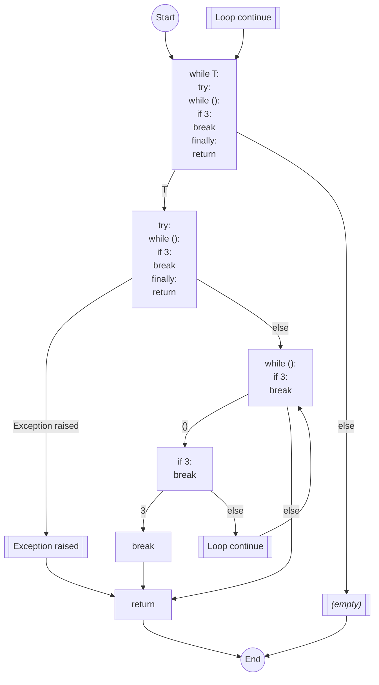
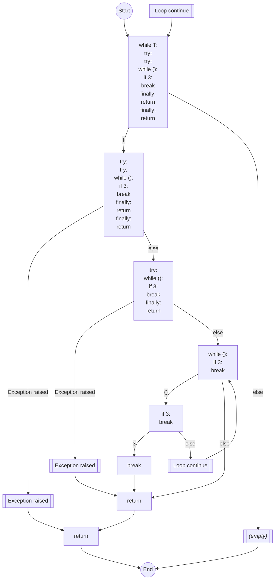

```yaml
number: 15276
title: "[`internal`] Return statements in finally block point to end block for `unreachable` (`PLW0101`)"
type: pull_request
state: merged
author: dylwil3
labels:
  - bug
  - rule
  - internal
assignees: []
merged: true
base: main
head: cfg-infloop
created_at: 2025-01-05T19:47:01Z
updated_at: 2025-01-07T17:26:09Z
url: https://github.com/astral-sh/ruff/pull/15276
synced_at: 2026-01-10T20:34:00Z
```

# [`internal`] Return statements in finally block point to end block for `unreachable` (`PLW0101`)

---

_Pull request opened by @dylwil3 on 2025-01-05 19:47_

Note: `PLW0101` remains in testing rather than preview, so this PR does not modify any public behavior (hence the title beginning with `internal` rather than `pylint`, for the sake of the changelog.)

Fixes an error in the processing of `try` statements in the control flow graph builder.

When processing a try statement, the block following a `return` was forced to point to the `finally` block. However, if the return was _in_ the `finally` block, this caused the block to point to itself. In the case where the whole `try-finally` statement was also included inside of a loop, this caused an infinite loop in the builder for the control flow graph as it attempted to resolve edges.

Closes #15248

## Test function
### Source
```python
def l():
    while T:
        try:
            while ():
                if 3:
                    break
        finally:
            return
```

### Control Flow Graph


---

_Label `rule` added by @dylwil3 on 2025-01-05 19:47_

---

_Label `testing` added by @dylwil3 on 2025-01-05 19:47_

---

_Label `bug` added by @dylwil3 on 2025-01-05 19:47_

---

_Label `testing` removed by @dylwil3 on 2025-01-05 19:47_

---

_Label `internal` added by @AlexWaygood on 2025-01-05 19:47_

---

_Comment by @github-actions[bot] on 2025-01-05 19:54_

<!-- generated-comment ecosystem -->
## `ruff-ecosystem` results
### Linter (stable)
✅ ecosystem check detected no linter changes.

### Linter (preview)
✅ ecosystem check detected no linter changes.


---

_Comment by @MichaReiser on 2025-01-05 21:44_

Is this overlapping with https://github.com/astral-sh/ruff/pull/15278 or do they fix different issues?

---

_Comment by @augustelalande on 2025-01-06 00:19_

Yes they are attempting to fix the same issue. Technically, this PR is more of a band-aid because the CFG should not fall through to the finally block in the `post_process_try` and is only doing so because of the issue I pointed out in #15278. Still I would recommend applying both changes: #15276 and #15278 to make it more robust.

---

_Comment by @dylwil3 on 2025-01-06 02:34_

I agree we should apply both corrections to the CFG construction, but I think we should keep the rule as "test" for now. 

I'm not so worried about discovering more edge cases where the CFG needs improvements, that's fine. However, infinite loops or panics are more disruptive since they cause the whole `ruff` call to crash. So I would feel more comfortable if we could either prove that the loops in `post_process_loop` and `post_process_try` must terminate, or, even better, replace them with some bounded `for` loop (which we know to be correct for some other reason).

---

_Comment by @MichaReiser on 2025-01-06 07:47_

Thanks for the explanation. 

What's the CFG if we wrap the `try` statement in another `try` with a `finally` block?

---

_Comment by @dylwil3 on 2025-01-07 03:14_

> What's the CFG if we wrap the try statement in another try with a finally block?

Like this, which looks correct to me:

```python
def l():
    while T:
        try:
            try:
                while ():
                    if 3:
                        break
            finally:
                return
        finally:
            return
```




---

_Review comment by @MichaReiser on `crates/ruff_linter/src/rules/pylint/rules/unreachable.rs`:674 on 2025-01-07 07:56_

This would probably be a small refactor and is something better left for its own PR but we could have better runtime assertions around preventing loops by introducing a `blocks.set_next(idx, next)` method that contains an assertion that `idx` and the `next`'s index aren't equal. 

---

_@MichaReiser approved on 2025-01-07 07:57_

---

_Merged by @dylwil3 on 2025-01-07 17:26_

---

_Closed by @dylwil3 on 2025-01-07 17:26_

---

_Branch deleted on 2025-01-07 17:26_

---
