```yaml
number: 5719
title: "Add an overview of Ruff's compilation pipeline to the docs"
type: pull_request
state: merged
author: charliermarsh
labels:
  - documentation
assignees: []
merged: true
base: main
head: charlie/compilation
created_at: 2023-07-12T20:32:13Z
updated_at: 2023-07-13T17:07:18Z
url: https://github.com/astral-sh/ruff/pull/5719
synced_at: 2026-01-12T15:55:19Z
```

# Add an overview of Ruff's compilation pipeline to the docs

---

_@charliermarsh_

## Summary

I originally wrote this in Notion but it seems preferable to publish it publicly in the documentation. Feedback welcome!

---

_Review requested from @MichaReiser by @charliermarsh on 2023-07-12 20:32_

---

_Review requested from @zanieb by @charliermarsh on 2023-07-12 20:32_

---

_Review requested from @konstin by @charliermarsh on 2023-07-12 20:32_

---

_Review requested from @dhruvmanila by @charliermarsh on 2023-07-12 20:32_

---

_Comment by @charliermarsh on 2023-07-12 20:32_

Just adding everyone, feel free to read if interested, otherwise I'll merge EOD tomorrow if no one feels like reviewing :D

---

_Label `documentation` added by @charliermarsh on 2023-07-12 20:34_

---

_@charliermarsh reviewed on 2023-07-12 20:53_

---

_Review comment by @charliermarsh on `.markdownlint.yaml`:15 on 2023-07-12 20:53_

I think this is more trouble than it's worth... And for whatever reason, when truncated the nested ordered list below to fit line length, `mdformat` was then requiring that I indent it to three spaces? Which MkDocs doesn't render as a nested list?

---

_@MichaReiser approved on 2023-07-12 20:53_

---

_Comment by @charliermarsh on 2023-07-12 21:12_

So close to turning off `mdformat`!!!

---

_Comment by @github-actions[bot] on 2023-07-12 21:19_

## PR Check Results
### Ecosystem
✅ ecosystem check detected no changes.

### Benchmark
#### Linux
```
group                                      main                                   pr
-----                                      ----                                   --
formatter/large/dataset.py                 1.00      8.0±0.02ms     5.1 MB/sec    1.00      8.0±0.04ms     5.1 MB/sec
formatter/numpy/ctypeslib.py               1.00   1855.2±1.40µs     9.0 MB/sec    1.00   1860.7±2.89µs     8.9 MB/sec
formatter/numpy/globals.py                 1.00    207.7±0.86µs    14.2 MB/sec    1.00    208.5±1.54µs    14.2 MB/sec
formatter/pydantic/types.py                1.00      4.0±0.01ms     6.3 MB/sec    1.00      4.0±0.01ms     6.3 MB/sec
linter/all-rules/large/dataset.py          1.01     13.7±0.10ms     3.0 MB/sec    1.00     13.5±0.03ms     3.0 MB/sec
linter/all-rules/numpy/ctypeslib.py        1.00      3.4±0.01ms     4.9 MB/sec    1.00      3.4±0.00ms     4.9 MB/sec
linter/all-rules/numpy/globals.py          1.00    446.3±0.85µs     6.6 MB/sec    1.01    451.0±2.75µs     6.5 MB/sec
linter/all-rules/pydantic/types.py         1.00      6.0±0.01ms     4.2 MB/sec    1.00      6.0±0.01ms     4.2 MB/sec
linter/default-rules/large/dataset.py      1.01      6.7±0.04ms     6.1 MB/sec    1.00      6.7±0.02ms     6.1 MB/sec
linter/default-rules/numpy/ctypeslib.py    1.00   1456.5±1.82µs    11.4 MB/sec    1.01   1467.1±3.07µs    11.3 MB/sec
linter/default-rules/numpy/globals.py      1.00    167.0±0.98µs    17.7 MB/sec    1.01    167.9±0.23µs    17.6 MB/sec
linter/default-rules/pydantic/types.py     1.00      3.0±0.01ms     8.5 MB/sec    1.01      3.0±0.01ms     8.4 MB/sec
```

#### Windows
```
group                                      main                                   pr
-----                                      ----                                   --
formatter/large/dataset.py                 1.00      9.5±0.03ms     4.3 MB/sec    1.01      9.6±0.13ms     4.2 MB/sec
formatter/numpy/ctypeslib.py               1.00      2.1±0.02ms     7.9 MB/sec    1.00      2.1±0.02ms     7.8 MB/sec
formatter/numpy/globals.py                 1.00    229.0±4.50µs    12.9 MB/sec    1.01    231.0±7.25µs    12.8 MB/sec
formatter/pydantic/types.py                1.00      4.7±0.03ms     5.4 MB/sec    1.00      4.7±0.03ms     5.4 MB/sec
linter/all-rules/large/dataset.py          1.00     16.0±0.16ms     2.5 MB/sec    1.01     16.1±0.17ms     2.5 MB/sec
linter/all-rules/numpy/ctypeslib.py        1.00      4.2±0.03ms     4.0 MB/sec    1.00      4.2±0.05ms     4.0 MB/sec
linter/all-rules/numpy/globals.py          1.00    429.8±6.90µs     6.9 MB/sec    1.00    428.6±7.09µs     6.9 MB/sec
linter/all-rules/pydantic/types.py         1.00      7.2±0.06ms     3.5 MB/sec    1.02      7.3±0.13ms     3.5 MB/sec
linter/default-rules/large/dataset.py      1.01      8.2±0.12ms     4.9 MB/sec    1.00      8.2±0.06ms     5.0 MB/sec
linter/default-rules/numpy/ctypeslib.py    1.00  1689.5±18.45µs     9.9 MB/sec    1.00  1683.9±24.09µs     9.9 MB/sec
linter/default-rules/numpy/globals.py      1.01    181.3±1.50µs    16.3 MB/sec    1.00    180.4±1.85µs    16.4 MB/sec
linter/default-rules/pydantic/types.py     1.01      3.7±0.04ms     6.9 MB/sec    1.00      3.6±0.02ms     7.0 MB/sec
```
<!-- thollander/actions-comment-pull-request "PR Check Results" -->

---

_Comment by @MichaReiser on 2023-07-12 21:19_

> So close to turning off `mdformat`!!!

Use prettier 😉

---

_Comment by @janosh on 2023-07-12 21:25_

@charliermarsh Isn't this an ideal use case for a mermaid diagram? (I take no credit, this one is GPT4 generated)

```mermaid
graph TD
    A[<b>File discovery</b><br/>Locate all Python files in specified subdirectories]
    B[<b>Package resolution</b><br/>Determine the 'package root' for every file]
    C[<b>Cache initialization</b><br/>Initialize an empty cache for each 'package root']
    D[<b>Analysis</b><br/>Run analysis on each file]
    D1[<b>Cache read</b><br/>Short-circuit and return cached diagnostics if file is cached]
    D2[<b>Tokenization</b><br/>Run the lexer over the file to generate a token stream]
    D3[<b>Indexing</b><br/>Extract metadata from the token stream]
    D4[<b>Token-based rule evaluation</b><br/>Run lint rules based on the token stream]
    D5[<b>Filesystem-based rule evaluation</b><br/>Run lint rules based on filesystem contents]
    D6[<b>Logical line-based rule evaluation</b><br/>Run lint rules based on logical lines]
    D7[<b>Parsing</b><br/>Run the parser over the token stream to produce an AST]
    D8[<b>AST-based rule evaluation</b><br/>Run lint rules based on the AST]
    D9[<b>Import-based rule evaluation</b><br/>Run lint rules based on the module's imports]
    D10[<b>Physical line-based rule evaluation</b><br/>Run lint rules based on logical lines]
    D11[<b>Suppression enforcement</b><br/>Remove any violations that are suppressed]
    D12[<b>Cache write</b><br/>Write the diagnostics to the package cache]
    E[<b>Reporting</b><br/>Print diagnostics in the specified format and output]

    A --> B
    B --> C
    C --> D
    D --> D1
    D1 --> D2
    D2 --> D3
    D3 --> D4
    D4 --> D5
    D5 --> D6
    D6 --> D7
    D7 --> D8
    D8 --> D9
    D9 --> D10
    D10 --> D11
    D11 --> D12
    D12 --> E
```

<h1 align="center">Ruff compilation pipeline</h1>



<details><summary>Details</summary>

```md
graph TD
    A[<b>File discovery</b><br/>Locate all Python files in specified subdirectories]
    B[<b>Package resolution</b><br/>Determine the 'package root' for every file]
    C[<b>Cache initialization</b><br/>Initialize an empty cache for each 'package root']
    D[<b>Analysis</b><br/>Run analysis on each file]
    D1[<b>Cache read</b><br/>Short-circuit and return cached diagnostics if file is cached]
    D2[<b>Tokenization</b><br/>Run the lexer over the file to generate a token stream]
    D3[<b>Indexing</b><br/>Extract metadata from the token stream]
    D4[<b>Token-based rule evaluation</b><br/>Run lint rules based on the token stream]
    D5[<b>Filesystem-based rule evaluation</b><br/>Run lint rules based on filesystem contents]
    D6[<b>Logical line-based rule evaluation</b><br/>Run lint rules based on logical lines]
    D7[<b>Parsing</b><br/>Run the parser over the token stream to produce an AST]
    D8[<b>AST-based rule evaluation</b><br/>Run lint rules based on the AST]
    D9[<b>Import-based rule evaluation</b><br/>Run lint rules based on the module's imports]
    D10[<b>Physical line-based rule evaluation</b><br/>Run lint rules based on logical lines]
    D11[<b>Suppression enforcement</b><br/>Remove any violations that are suppressed]
    D12[<b>Cache write</b><br/>Write the diagnostics to the package cache]
    E[<b>Reporting</b><br/>Print diagnostics in the specified format and output]

    A --> B
    B --> C
    C --> D
    D --> D1
    D1 --> D2
    D2 --> D3
    D3 --> D4
    D4 --> D5
    D5 --> D6
    D6 --> D7
    D7 --> D8
    D8 --> D9
    D9 --> D10
    D10 --> D11
    D11 --> D12
    D12 --> E
```
</details> 

---

_Comment by @charliermarsh on 2023-07-13 02:45_

Prettier makes the same edit (3-space indent for the nested list) so I feel like I'm doing something wrong in the Markdown.

---

_Comment by @konstin on 2023-07-13 07:02_

> So close to turning off mdformat

tbh i'm in favor, it didn't feel like the formatting i'd like to see

---

_Review comment by @konstin on `CONTRIBUTING.md`:698 on 2023-07-13 07:03_

i think "package root" needs an explananation

---

_Review comment by @konstin on `CONTRIBUTING.md`:699 on 2023-07-13 07:04_

a sentence on when we cache would be good here

---

_Review comment by @konstin on `CONTRIBUTING.md`:718 on 2023-07-13 07:07_

i'd link `Checker` and `SemanticModel` here

---

_@konstin approved on 2023-07-13 07:07_

this is really useful!

---

_Comment by @MichaReiser on 2023-07-13 07:53_

> @charliermarsh Isn't this an ideal use case for a mermaid diagram? (I take no credit, this one is GPT4 generated)

I love graphs. But I'm not sure if it is useful here. At least not if there's no branching involved. 

---

_Merged by @charliermarsh on 2023-07-13 16:50_

---

_Closed by @charliermarsh on 2023-07-13 16:50_

---

_Branch deleted on 2023-07-13 16:50_

---
