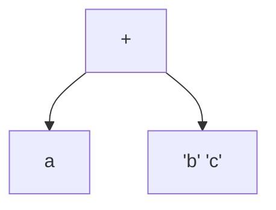

```yaml
number: 7145
title: Split implicit concatenated strings before binary expressions
type: pull_request
state: merged
author: MichaReiser
labels:
  - formatter
assignees: []
merged: true
base: main
head: flatten-binary-expression
created_at: 2023-09-05T09:53:36Z
updated_at: 2023-09-21T10:38:43Z
url: https://github.com/astral-sh/ruff/pull/7145
synced_at: 2026-01-12T02:39:09Z
```

# Split implicit concatenated strings before binary expressions

---

_Pull request opened by @MichaReiser on 2023-09-05 09:53_

## Summary

This PR improves Black compatibility by breaking implicit concatenated string before any binary expression. 

```python
(
    b + c + d + "aaaaaaaaaaaaaaaaaaaaaaaaaaaaa"
    "bbbbbbbbbbbbbbbbbbbbbbbbbbbbb"
    "cccccccccccccccccccccccccc" % aaaaaaaaaaaa + x
)
```

You can see how Black inserts line breaks between the implicit concatenated string parts but it keeps the binary expression operators and operands on the same line. 

The challenge with implementing this formatting is that it is necessary that the outermost group is the group around the implicit concatenated strings but this doesn't match our AST structure: The strings are leaf nodes in the AST.  See the tree for a very basic example `a + 'b' 'c'`



The existing implementation used a custom layout for when the implicit concatenated string is on the left side but it isn't able to handle implicit concatenated strings on the right or in nested binary expressions. 

This PR solves this by *flattening* the binary expression. From the code documentation

```rust
/// Binary chain represented as a flat vector where operands are stored at even indices and operators
/// add odd indices.
///
/// ```python
/// a + 5 * 3 + 2
/// ```
///
/// Gets parsed as:
///
/// ```text
/// graph
/// +
/// ├──a
/// ├──*
/// │   ├──b
/// │   └──c
/// └──d
/// ```
///
/// The slice representation of the above is closer to what you have in source. It's a simple sequence of operands and operators,
/// entirely ignoring operator precedence (doesn't flatten parenthesized expressions):
///
/// ```text
/// -----------------------------
/// | a | + | 5 | * | 3 | + | 2 |
/// -----------------------------
/// ```
///
/// The advantage of a flat structure are:
/// * It becomes possible to adjust the operator / operand precedence. E.g splitting implicit concatenated strings before `+` operations.
/// * It allows arbitrary slicing of binary expressions for as long as a slice always starts and ends with an operand.
///
/// A slice is guaranteed to always start and end with an operand. The smallest valid slice is a slice containing a single operand.
/// Operands in multi-operand slices are separated by operators.
```

The flat representation allows to first split the binary expression by implicit concatenated strings and only then, operator by operator based on the operator precedence. 

## Test Plan

I added new tests, reviewed that the changes now match Black's formatting. 

The PR improves the black compatibility 

**PR**
| project      | similarity index  | total files       | changed files     |
|--------------|------------------:|------------------:|------------------:|
| cpython      |           0.76083 |              1789 |              1633 |
| **django**       |           0.99966 |              2760 |                58 |
| **transformers** |           0.99928 |              2587 |               454 |
| twine        |           0.99982 |                33 |                 1 | 
| typeshed     |           0.99978 |              3496 |              2173 |
| **warehouse**    |           0.99823 |               648 |                23 |
| **zulip**        |           0.99948 |              1437 |                28 |

**Base**
| project      | similarity index  | total files       | changed files     |
|--------------|------------------:|------------------:|------------------:|
| cpython      |           0.76083 |              1789 |              1632 |
| django       |           0.99957 |              2760 |                67 |
| transformers |           0.99928 |              2587 |               456 |
| twine        |           0.99982 |                33 |                 1 |
| typeshed     |           0.99978 |              3496 |              2173 |
| warehouse    |           0.99818 |               648 |                24 |
| zulip        |           0.99942 |              1437 |                32 |


---

_Comment by @MichaReiser on 2023-09-05 09:53_

Current dependencies on/for this PR:
* main
  * **PR #7145** <a href="https://app.graphite.dev/github/pr/astral-sh/ruff/7145" target="_blank"></a>  👈
    * **PR #7193** <a href="https://app.graphite.dev/github/pr/astral-sh/ruff/7193" target="_blank"></a> 
      * **PR #7215** <a href="https://app.graphite.dev/github/pr/astral-sh/ruff/7215" target="_blank"></a> 
        * **PR #7217** <a href="https://app.graphite.dev/github/pr/astral-sh/ruff/7217" target="_blank"></a> 
          * **PR #7219** <a href="https://app.graphite.dev/github/pr/astral-sh/ruff/7219" target="_blank"></a> 
            * **PR #7242** <a href="https://app.graphite.dev/github/pr/astral-sh/ruff/7242" target="_blank"></a> 
              * **PR #7567** <a href="https://app.graphite.dev/github/pr/astral-sh/ruff/7567" target="_blank"></a> 

This comment was auto-generated by [Graphite](https://app.graphite.dev/github/pr/astral-sh/ruff/7145?utm_source=stack-comment).

---

_Label `formatter` added by @MichaReiser on 2023-09-05 10:02_

---

_Review comment by @MichaReiser on `crates/ruff_python_formatter/src/comments/format.rs`:119 on 2023-09-06 12:22_

I removed the `Node` variance because this PR removes the last `trailing_node_comments` reference

---

_Review comment by @MichaReiser on `crates/ruff_python_formatter/src/expression/operator.rs`:6 on 2023-09-06 12:23_

I moved this out of the `bin_expr` formatting because it is also used in augmented assign and it removes the size of the `bin_expr` file a bit. The code itself is unchanged.

---

_Review comment by @MichaReiser on `crates/ruff_python_formatter/src/lib.rs`:171 on 2023-09-06 12:24_

This is not strictly related to the PR but I ran into situations where I missed to format some comments but was unable to see the comments in the playground because it extracted them from the formatted output... 

This change now allows to see the comments even if the formatting itself fails.

---

_Review comment by @MichaReiser on `crates/ruff_python_formatter/tests/snapshots/format@expression__binary_implicit_string.py.snap`:269 on 2023-09-06 12:25_

I'll add support for compare expressions in a separate PR

---

_Review comment by @MichaReiser on `crates/ruff_python_formatter/src/expression/expr_bin_op.rs`:35 on 2023-09-06 12:26_

I'll add support for f-strings in a separate PR

---

_Review comment by @MichaReiser on `crates/ruff_python_formatter/src/expression/expr_bin_op.rs`:32 on 2023-09-06 12:27_

The `LeftString` was a "cheap" implementation of the new formatting logic that only supported implicit concatenated strings at the left of a binary expression. The new formatting supports implicit concatenated strings in arbitrary positions. 

---

_Review comment by @MichaReiser on `crates/ruff_python_formatter/src/expression/expr_bin_op.rs`:419 on 2023-09-06 12:28_

Using the same layout is necessary to implement `Deref` on `BinaryChain` 

---

_Comment by @github-actions[bot] on 2023-09-06 12:36_

## PR Check Results
### Ecosystem
✅ ecosystem check detected no changes.


---

_Added to milestone `Formatter: Beta` by @MichaReiser on 2023-09-06 12:42_

---

_Marked ready for review by @MichaReiser on 2023-09-06 12:42_

---

_Comment by @MichaReiser on 2023-09-06 12:43_

The performance benchmarks look off. This should not improve performance. I would be happy if it doesn't regress performance

---

_@MichaReiser reviewed on 2023-09-06 12:44_

---

_Review requested from @charliermarsh by @MichaReiser on 2023-09-06 12:44_

---

_Review requested from @konstin by @MichaReiser on 2023-09-06 12:44_

---

_Review comment by @charliermarsh on `crates/ruff_python_formatter/src/expression/expr_bin_op.rs`:391 on 2023-09-06 13:09_

Clever.

---

_Review comment by @charliermarsh on `crates/ruff_python_formatter/src/expression/expr_bin_op.rs`:569 on 2023-09-06 13:10_

Doesn't it need to hold at least one _operand_? That's the debug assertion in the constructor.

---

_Review comment by @charliermarsh on `crates/ruff_python_formatter/src/expression/expr_bin_op.rs`:553 on 2023-09-06 13:11_

Is this accidental or intended as documentation?

---

_Review comment by @charliermarsh on `crates/ruff_python_formatter/src/expression/expr_bin_op.rs`:607 on 2023-09-06 13:11_

Nit: remove?

---

_Review comment by @charliermarsh on `crates/ruff_python_formatter/src/expression/expr_bin_op.rs`:765 on 2023-09-06 13:12_

Nice. This in turn ensures that the unsafe constructor is valid?

---

_Review comment by @charliermarsh on `crates/ruff_python_formatter/src/expression/expr_bin_op.rs`:445 on 2023-09-06 13:15_

Should `end.0.get()` be exposed as a method instead of accessing the wrapped type?

---

_@charliermarsh approved on 2023-09-06 13:15_

---

_Review comment by @MichaReiser on `crates/ruff_python_formatter/src/expression/expr_bin_op.rs`:569 on 2023-09-06 13:57_

I extended the comment. 

---

_@MichaReiser reviewed on 2023-09-06 13:57_

---

_Review comment by @MichaReiser on `crates/ruff_python_formatter/src/expression/expr_bin_op.rs`:765 on 2023-09-06 13:58_

I don't think it's a 100% guaranteed but the unsafe code is invalid for sure if these constraints are violated.

---

_@MichaReiser reviewed on 2023-09-06 13:58_

---

_Comment by @MichaReiser on 2023-09-06 14:08_

I moved the formatting to its own file as preparation for re-using it for `ExprCompare`. It makes rebasing and reviewing the followup PR easier

---

_Comment by @codspeed-hq[bot] on 2023-09-06 14:20_

## [CodSpeed Performance Report](https://codspeed.io/astral-sh/ruff/branches/flatten-binary-expression)

### Merging #7145 will **degrade performances by 2.44%**

<sub>Comparing <code>flatten-binary-expression</code> (668d1c4) with <code>main</code> (fa0b6f4)</sub>


### Summary

`❌ 1` regressions
`✅ 24` untouched benchmarks


> :warning: _Please fix the performance issues or [acknowledge them on CodSpeed](https://codspeed.io/astral-sh/ruff/branches/flatten-binary-expression)._

### Benchmarks breakdown

|     | Benchmark | `main` | `flatten-binary-expression` | Change |
| --- | --------- | ----------------------- | ------------------- | ------ |
| ❌ | `linter/all-rules[numpy/ctypeslib.py]` | 32.9 ms | 33.8 ms | -2.44% |


---

_Comment by @MichaReiser on 2023-09-06 14:34_

> ## [CodSpeed Performance Report](https://codspeed.io/astral-sh/ruff/branches/flatten-binary-expression)
> ### Merging #7145 will **degrade performances by 2.44%**
> 
> Comparing `flatten-binary-expression` ([668d1c4](https://github.com/astral-sh/ruff/commit/668d1c4948406b6ff8df48b2067e87b8095031f9)) with `main` ([fa0b6f4](https://github.com/astral-sh/ruff/commit/fa0b6f4813944af7b765fe4bc3705e75eae5acc0))
> ### Summary
> 
> `❌ 1` regressions `✅ 24` untouched benchmarks
> 
> > ⚠️ _Please fix the performance issues or [acknowledge them on CodSpeed](https://codspeed.io/astral-sh/ruff/branches/flatten-binary-expression)._
> 
> ### Benchmarks breakdown
> 	Benchmark 	`main` 	`flatten-binary-expression` 	Change
> ❌ 	`linter/all-rules[numpy/ctypeslib.py]` 	32.9 ms 	33.8 ms 	-2.44%

I doubt that ;)

---

_Merged by @MichaReiser on 2023-09-08 06:51_

---

_Closed by @MichaReiser on 2023-09-08 06:51_

---

_Branch deleted on 2023-09-08 06:51_

---
