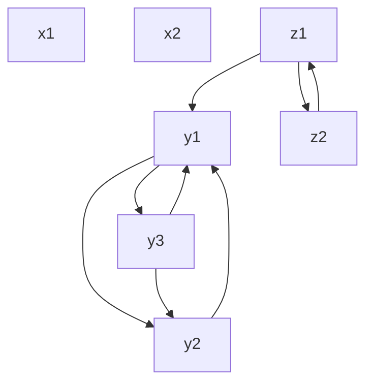

```yaml
number: 1111
title: Excessive runtime for mutually referential instance attributes
type: issue
state: closed
author: sharkdp
labels:
  - performance
  - attribute access
assignees: []
created_at: 2025-09-01T08:57:36Z
updated_at: 2025-10-16T11:24:43Z
url: https://github.com/astral-sh/ty/issues/1111
synced_at: 2026-01-10T02:06:24Z
```

# Excessive runtime for mutually referential instance attributes

---

_Issue opened by @sharkdp on 2025-09-01 08:57_

The following example is adapted from the problematic `sympy` snippet in https://github.com/astral-sh/ruff/pull/18473#issuecomment-3240412138 (with explicitly-annotated `self` parameters). It takes ~3 seconds to type-check:

<details>

```py
class MusculotendonBase:
    def __init__(
        self: "MusculotendonBase",
        name,
        pathway,
        activation_dynamics,
        *,
        tendon_slack_length=None,
        peak_isometric_force=None,
        optimal_fiber_length=None,
        maximal_fiber_velocity=None,
        optimal_pennation_angle=None,
        fiber_damping_coefficient=None,
        with_defaults=False,
    ):
        self.name = name

        self._activation_dynamics = activation_dynamics
        self._child_objects = (self._activation_dynamics,)

        # Constants
        if tendon_slack_length is not None:
            self._l_T_slack = tendon_slack_length

        # Musculotendon dynamics
        self._with_defaults = with_defaults

        self._force = -self._F_T

    def _rigid_tendon_musculotendon_dynamics(self: "MusculotendonBase"):
        """Rigid tendon musculotendon."""
        self._l_MT = self.pathway.length
        self._v_MT = self.pathway.extension_velocity
        self._l_T = self._l_T_slack
        self._l_T_tilde = Integer(1)
        self._l_M = sqrt(
            (self._l_MT - self._l_T) ** 2 + (self._l_M_opt * sin(self._alpha_opt)) ** 2
        )
        self._l_M_tilde = self._l_M / self._l_M_opt
        self._v_M = self._v_MT * (self._l_MT - self._l_T_slack) / self._l_M
        self._v_M_tilde = self._v_M / self._v_M_max
        if self._with_defaults:
            self._fl_T = self.curves.tendon_force_length.with_defaults(self._l_T_tilde)
            self._fl_M_pas = self.curves.fiber_force_length_passive.with_defaults(
                self._l_M_tilde
            )
            self._fl_M_act = self.curves.fiber_force_length_active.with_defaults(
                self._l_M_tilde
            )
            self._fv_M = self.curves.fiber_force_velocity.with_defaults(self._v_M_tilde)
        else:
            fl_T_constants = symbols(f"c_0:4_fl_T_{self.name}")
            self._fl_T = self.curves.tendon_force_length(
                self._l_T_tilde, *fl_T_constants
            )
            fl_M_pas_constants = symbols(f"c_0:2_fl_M_pas_{self.name}")
            self._fl_M_pas = self.curves.fiber_force_length_passive(
                self._l_M_tilde, *fl_M_pas_constants
            )
            fl_M_act_constants = symbols(f"c_0:12_fl_M_act_{self.name}")
            self._fl_M_act = self.curves.fiber_force_length_active(
                self._l_M_tilde, *fl_M_act_constants
            )
            fv_M_constants = symbols(f"c_0:4_fv_M_{self.name}")
            self._fv_M = self.curves.fiber_force_velocity(
                self._v_M_tilde, *fv_M_constants
            )
        self._F_M_tilde = (
            self.a * self._fl_M_act * self._fv_M
            + self._fl_M_pas
            + self._beta * self._v_M_tilde
        )
        self._F_T_tilde = self._F_M_tilde
        self._F_M = self._F_M_tilde * self._F_M_max
        self._cos_alpha = cos(self._alpha_opt)
        self._F_T = self._F_M * self._cos_alpha

        # Containers
        self._state_vars = zeros(0, 1)
        self._input_vars = zeros(0, 1)
        self._state_eqns = zeros(0, 1)
        self._curve_constants = (
            Matrix(
                fl_T_constants
                + fl_M_pas_constants
                + fl_M_act_constants
                + fv_M_constants
            )
            if not self._with_defaults
            else zeros(0, 1)
        )

    def _tendon_force_explicit_musculotendon_dynamics(self: "MusculotendonBase"):
        """Elastic tendon musculotendon using `F_T_tilde` as a state."""
        self._F_T_tilde = dynamicsymbols(f"F_T_tilde_{self.name}")
        self._l_MT = self.pathway.length
        self._v_MT = self.pathway.extension_velocity
        self._fl_T = self._F_T_tilde
        if self._with_defaults:
            self._fl_T_inv = self.curves.tendon_force_length_inverse.with_defaults(
                self._fl_T
            )
        else:
            fl_T_constants = symbols(f"c_0:4_fl_T_{self.name}")
            self._fl_T_inv = self.curves.tendon_force_length_inverse(
                self._fl_T, *fl_T_constants
            )
        self._l_T_tilde = self._fl_T_inv
        self._l_T = self._l_T_tilde * self._l_T_slack
        self._l_M = sqrt(
            (self._l_MT - self._l_T) ** 2 + (self._l_M_opt * sin(self._alpha_opt)) ** 2
        )
        self._l_M_tilde = self._l_M / self._l_M_opt
        if self._with_defaults:
            self._fl_M_pas = self.curves.fiber_force_length_passive.with_defaults(
                self._l_M_tilde
            )
            self._fl_M_act = self.curves.fiber_force_length_active.with_defaults(
                self._l_M_tilde
            )
        else:
            fl_M_pas_constants = symbols(f"c_0:2_fl_M_pas_{self.name}")
            self._fl_M_pas = self.curves.fiber_force_length_passive(
                self._l_M_tilde, *fl_M_pas_constants
            )
            fl_M_act_constants = symbols(f"c_0:12_fl_M_act_{self.name}")
            self._fl_M_act = self.curves.fiber_force_length_active(
                self._l_M_tilde, *fl_M_act_constants
            )
        self._cos_alpha = (self._l_MT - self._l_T) / self._l_M
        self._F_T = self._F_T_tilde * self._F_M_max
        self._F_M = self._F_T / self._cos_alpha
        self._F_M_tilde = self._F_M / self._F_M_max
        self._fv_M = (self._F_M_tilde - self._fl_M_pas) / (self.a * self._fl_M_act)
        if self._with_defaults:
            self._fv_M_inv = self.curves.fiber_force_velocity_inverse.with_defaults(
                self._fv_M
            )
        else:
            fv_M_constants = symbols(f"c_0:4_fv_M_{self.name}")
            self._fv_M_inv = self.curves.fiber_force_velocity_inverse(
                self._fv_M, *fv_M_constants
            )
        self._v_M_tilde = self._fv_M_inv
        self._v_M = self._v_M_tilde * self._v_M_max
        self._v_T = self._v_MT - (self._v_M / self._cos_alpha)
        self._v_T_tilde = self._v_T / self._l_T_slack
        if self._with_defaults:
            self._fl_T = self.curves.tendon_force_length.with_defaults(self._l_T_tilde)
        else:
            self._fl_T = self.curves.tendon_force_length(
                self._l_T_tilde, *fl_T_constants
            )
        self._dF_T_tilde_dt = self._fl_T.diff(dynamicsymbols._t).subs(
            {self._l_T_tilde.diff(dynamicsymbols._t): self._v_T_tilde}
        )

        self._state_vars = Matrix([self._F_T_tilde])
        self._input_vars = zeros(0, 1)
        self._state_eqns = Matrix([self._dF_T_tilde_dt])
        self._curve_constants = (
            Matrix(
                fl_T_constants
                + fl_M_pas_constants
                + fl_M_act_constants
                + fv_M_constants
            )
            if not self._with_defaults
            else zeros(0, 1)
        )
```

</details>

---

_Assigned to @sharkdp by @sharkdp on 2025-09-01 08:57_

---

_Label `performance` added by @sharkdp on 2025-09-01 08:57_

---

_Label `attribute access` added by @sharkdp on 2025-09-01 08:57_

---

_Added to milestone `Beta` by @sharkdp on 2025-09-01 08:57_

---

_Comment by @sharkdp on 2025-09-01 09:57_

I can reproduce this with something like the following, where each method combines various implicit instance attributes. So I don't think there's anything particularly interesting in the snippet above. For some reason, code like this leads to a combinatorial explosion. This takes 24 s to type check. I suspect that a solution to this issue might also render https://github.com/astral-sh/ruff/pull/20128 unnecessary. Maybe reachability constraints were never the culprit there. They probably just made things more extreme.
```py
def combine(*args) -> int:
    return 0


class C:
    def __init__(self: "C"):
        self.x1 = 0
        self.x2 = 0
        self.x3 = 0
        self.x4 = 0
        self.x5 = 0

    def f1(self: "C"):
        self.x1 = combine(self.x2, self.x3, self.x4, self.x5)
        self.x2 = combine(self.x1, self.x3, self.x4, self.x5)
        self.x3 = combine(self.x1, self.x2, self.x4, self.x5)
        self.x4 = combine(self.x1, self.x2, self.x3, self.x5)
        self.x5 = combine(self.x1, self.x2, self.x3, self.x4)

    def f2(self: "C"):
        self.x1 = combine(self.x2, self.x3, self.x4, self.x5)
        self.x2 = combine(self.x1, self.x3, self.x4, self.x5)
        self.x3 = combine(self.x1, self.x2, self.x4, self.x5)
        self.x4 = combine(self.x1, self.x2, self.x3, self.x5)
        self.x5 = combine(self.x1, self.x2, self.x3, self.x4)

    def f3(self: "C"):
        self.x1 = combine(self.x2, self.x3, self.x4, self.x5)
        self.x2 = combine(self.x1, self.x3, self.x4, self.x5)
        self.x3 = combine(self.x1, self.x2, self.x4, self.x5)
        self.x4 = combine(self.x1, self.x2, self.x3, self.x5)
        self.x5 = combine(self.x1, self.x2, self.x3, self.x4)
```

It does seem to be related to cycles / self-references, because if we replace the method bodies with this (only references to "higher" variables, no cycle), it type-checks immediately:
```py
self.x1 = combine(self.x2, self.x3, self.x4, self.x5)
self.x2 = combine(self.x3, self.x4, self.x5)
self.x3 = combine(self.x4, self.x5)
self.x4 = combine(self.x5)
self.x5 = combine()
```

---

_Comment by @sharkdp on 2025-09-01 10:54_

I assume second example in https://github.com/astral-sh/ruff/pull/18473#issuecomment-3240412138 (the scipy one) is probably also related to this.

---

_Comment by @sharkdp on 2025-09-01 12:24_

These pictures show how a typical `infer_expression_types` (white) -> `infer_definition_types` (yellow) -> `infer_expression_types` -> `infer_attribute_load` (white) -> … call stack for this looks like (before it hits a cycle, see dashed line):


Note how the same attribute (e.g. `x2`) can appear multiple times in the stack, because there are multiple `self.x2` expressions in the source code. But since we're caching at the expression level, those are different, from salsa's perspective.

And the caching at the `Type::member_lookup_with_policy` level doesn't seem to help, ~~maybe because there are so many different ways of calling the other (transitively) dependent queries from there that we need to re-evaluate `Type::member_lookup_with_policy` over and over again (for the same attribute) because we keep calling other queries in a different order or similar? It feels like I would have to know more about salsa to dig deeper.~~

---

_Comment by @sharkdp on 2025-09-01 14:43_

Oh, wow. This is interesting. I can fix this by *removing cycle handling* from both `infer_expression_types` and `infer_definition_types` (which is only possibly by making them non-queries). As we can see from the pictures above, it takes a long time to form an `infer_expression_types`-cycle because we need to come back to the same *AST node*. In contrast, by making these functions non-queries, the cycle handling on `member_lookup_with_policy` can take over which only needs to return back to the same *attribute name*, not the same AST node.

---

_Comment by @sharkdp on 2025-09-03 12:34_

We now believe that the root cause of this is a bug in salsa where `member_lookup_with_policy` queries are executed over and over again for the same inputs, when executed as part of a cycle (thanks to @carljm for helping figure this out). For the snippet above, this leads to tens of thousands of extra executions (where there should be only two for a query involved in a cycle):
```
      2 member_lookup_with_policy: C.x1
     26 member_lookup_with_policy: C.x2
    530 member_lookup_with_policy: C.x3
  13226 member_lookup_with_policy: C.x4
 341404 member_lookup_with_policy: C.x5
```

Something similar seems to be going on for the snippet in the first post here:

```
[…]
    148 member_lookup_with_policy: MusculotendonBase._fl_M_act
    148 member_lookup_with_policy: MusculotendonBase._fl_M_pas
    148 member_lookup_with_policy: MusculotendonBase._l_M_tilde
    325 member_lookup_with_policy: MusculotendonBase._l_M
    772 member_lookup_with_policy: MusculotendonBase._cos_alpha
   1034 member_lookup_with_policy: MusculotendonBase._l_T
   4284 member_lookup_with_policy: MusculotendonBase._F_M
   4645 member_lookup_with_policy: MusculotendonBase._F_T_tilde
   5352 member_lookup_with_policy: MusculotendonBase._fl_T_inv
   5353 member_lookup_with_policy: MusculotendonBase._fl_T
   5388 member_lookup_with_policy: MusculotendonBase._F_M_tilde
   7136 member_lookup_with_policy: MusculotendonBase._l_T_tilde
  13548 member_lookup_with_policy: MusculotendonBase._v_M
  22589 member_lookup_with_policy: MusculotendonBase._fv_M
  23340 member_lookup_with_policy: MusculotendonBase._fv_M_inv
  33876 member_lookup_with_policy: MusculotendonBase._v_M_tilde
```

And for the scipy snippet in https://github.com/astral-sh/ruff/pull/18473#issuecomment-3240412138

```
[…]
    205 member_lookup_with_policy: Self@_step_impl.t
   1356 member_lookup_with_policy: Self@_step_impl.h_abs
   2692 member_lookup_with_policy: Self@_step_impl.D
   2692 member_lookup_with_policy: Self@_step_impl.I
   2700 member_lookup_with_policy: Self@__init__.y
  44545 member_lookup_with_policy: BDF.order
```

It seems likely that this is also the cause for the other timeouts on ecosystem projects in https://github.com/astral-sh/ruff/pull/18473#issuecomment-3248754941. For example, here is `parso`:

```
  23244 member_lookup_with_policy: Self@_visit_part._indentation_tos
```

And `pycryptodome`:

```
   1090 member_lookup_with_policy: Self@decrypt._cache
   1090 member_lookup_with_policy: Self@_update._mac_status
   1622 member_lookup_with_policy: Self@decrypt._assoc_len
   2180 member_lookup_with_policy: Self@decrypt._mac_status
   2181 member_lookup_with_policy: Self@_update._cache
```

---

_Comment by @sharkdp on 2025-09-15 11:42_

To reproduce this, store the example from https://github.com/astral-sh/ty/issues/1111#issuecomment-3241694867 in a file, and then run:

```bash
cargo run --bin ty -- check snip.py -vvv 2>&1 | rg "ty_python_semantic::types: member_lookup_with_policy:"
```

Observe that `member_lookup_with_policy` is called over and over again for the same inputs. This does not happen if the body of the methods is replaced with the lower snippet in the same comment.

---

_Comment by @MichaReiser on 2025-09-15 11:47_

> Observe that member_lookup_with_policy is called over and over again for the same inputs. This does not happen if the body of the methods is replaced with the lower snippet in the same comment.

Do you know in which cycles `member_lookup_with_policy` participates? Are there nested cycles? How many times is each cycle executed?

---

_Comment by @MichaReiser on 2025-09-15 12:43_

> Oh, wow. This is interesting. I can fix this by _removing cycle handling_ from both `infer_expression_types` and `infer_definition_types` (which is only possibly by making them non-queries). As we can see from the pictures above, it takes a long time to form an `infer_expression_types`-cycle because we need to come back to the same _AST node_. In contrast, by making these functions non-queries, the cycle handling on `member_lookup_with_policy` can take over which only needs to return back to the same _attribute name_, not the same AST node.

https://github.com/salsa-rs/salsa/issues/841 could be relevant here because it would allow us to annotate higher-level functions, which may result in fewer nested cycles (assuming the above isn't a caching bug but an exponential explosion due to nested cycles)

---

_Comment by @sharkdp on 2025-09-15 13:34_

Just adding some more log counts here after talking to Micha. Note that there is a clear "2 N + 2" pattern between the number of `member_lookup_with_policy` calls and the number of `WillIterateCycle` events. Except for the instance attribute with the highest number, where the number of calls is even higher than 2 N + 2.

This suggests that the number of nested cycles (which are apparently not memoized in salsa) itself exhibits combinatorial growth:

```
four attributes, two methods:

      2 ty_python_semantic::types: member_lookup_with_policy: C.x1
     18 ty_python_semantic::types: member_lookup_with_policy: C.x2
    226 ty_python_semantic::types: member_lookup_with_policy: C.x3
   2476 ty_python_semantic::types: member_lookup_with_policy: C.x4

      8 WillIterateCycle { database_key: Type < 'db >::member_lookup_with_policy_(Id(3402)), iteration_count: IterationCount(1) } }
    112 WillIterateCycle { database_key: Type < 'db >::member_lookup_with_policy_(Id(3406)), iteration_count: IterationCount(1) } }
    884 WillIterateCycle { database_key: Type < 'db >::member_lookup_with_policy_(Id(3407)), iteration_count: IterationCount(1) } }

five attributes, two methods:

      2 ty_python_semantic::types: member_lookup_with_policy: C.x1
     18 ty_python_semantic::types: member_lookup_with_policy: C.x2
    226 ty_python_semantic::types: member_lookup_with_policy: C.x3
   3186 ty_python_semantic::types: member_lookup_with_policy: C.x4
  41340 ty_python_semantic::types: member_lookup_with_policy: C.x5

      8 WillIterateCycle { database_key: Type < 'db >::member_lookup_with_policy_(Id(3402)), iteration_count: IterationCount(1) } }
    112 WillIterateCycle { database_key: Type < 'db >::member_lookup_with_policy_(Id(3406)), iteration_count: IterationCount(1) } }
   1592 WillIterateCycle { database_key: Type < 'db >::member_lookup_with_policy_(Id(3407)), iteration_count: IterationCount(1) } }
  15388 WillIterateCycle { database_key: Type < 'db >::member_lookup_with_policy_(Id(3408)), iteration_count: IterationCount(1) } }
```

---

_Comment by @MichaReiser on 2025-09-15 14:33_

The next step for me here is to understand the max-cycle depth and how many queries are involved to assess if lifting cycle handling higher up (https://github.com/salsa-rs/salsa/issues/841) is a feasible solution

---

_Comment by @sharkdp on 2025-09-15 14:39_

The second question is something that I can answer. A typical query call stack looks like this (with `member_lookup_with_policy` at the top):

```
  2025-09-15T14:36:43.041123Z TRACE ty_project::db: Salsa event: Event { thread_id: ThreadId(2), kind: WillExecute { database_key: Type < 'db >::member_lookup_with_policy_(Id(3408)) } }
    at crates/ty_project/src/db.rs:59 on ThreadId(2)
    in ty_python_semantic::types::infer::infer_expression_types with expression=Id(180b) range=618..661 file=File(System("/home/shark/playground/test.py"))
    in ty_python_semantic::types::infer::infer_definition_types with range=608..615 file=File(System("/home/shark/playground/test.py"))
    in ty_python_semantic::types::infer::infer_expression_types with expression=Id(180d) range=742..785 file=File(System("/home/shark/playground/test.py"))
    in ty_python_semantic::types::infer::infer_expression_types with expression=Id(180a) range=556..599 file=File(System("/home/shark/playground/test.py"))
    in ty_python_semantic::types::infer::infer_definition_types with range=546..553 file=File(System("/home/shark/playground/test.py"))
    in ty_python_semantic::types::infer::infer_expression_types with expression=Id(180c) range=680..723 file=File(System("/home/shark/playground/test.py"))
    in ty_python_semantic::types::infer::infer_expression_types with expression=Id(1806) range=284..327 file=File(System("/home/shark/playground/test.py"))
    in ty_python_semantic::types::infer::infer_expression_types with expression=Id(1805) range=222..265 file=File(System("/home/shark/playground/test.py"))
    in ty_python_semantic::types::infer::infer_scope_types with scope=Id(1003) file=File(System("/home/shark/playground/test.py"))
    in ty_python_semantic::types::check_types with file=File(System("/home/shark/playground/test.py"))
    in ty_project::check_file with file=file(Id(c00))
    in ty_project::Project::check
```

---

_Comment by @MichaReiser on 2025-09-17 11:08_

I added some logging to Salsa to capture the max cycle-depth. We have 10 cycle heads for 2 methods and 5 attributes.

```
CycleHeads([
	CycleHead { database_key_index: infer_expression_types_impl(Id(1805)), iteration_count: IterationCount(0) }, 
	CycleHead { database_key_index: ClassLiteral < 'db >::implicit_attribute_inner_(Id(6c03)), iteration_count: IterationCount(0) }, 
	CycleHead { database_key_index: infer_expression_types_impl(Id(1806)), iteration_count: IterationCount(0) }, 
	CycleHead { database_key_index: Type < 'db >::member_lookup_with_policy_(Id(3402)), iteration_count: IterationCount(0) }, 
	CycleHead { database_key_index: Type < 'db >::member_lookup_with_policy_(Id(3406)), iteration_count: IterationCount(0) }, 
	CycleHead { database_key_index: infer_expression_types_impl(Id(1808)), iteration_count: IterationCount(1) }, 
	CycleHead { database_key_index: infer_expression_types_impl(Id(180c)), iteration_count: IterationCount(1) }, 
	CycleHead { database_key_index: Type < 'db >::member_lookup_with_policy_(Id(3407)), iteration_count: IterationCount(1) }, 
	CycleHead { database_key_index: infer_definition_types(Id(1411)), iteration_count: IterationCount(1) }, 
	CycleHead { database_key_index: Type < 'db >::member_lookup_with_policy_(Id(3408)), iteration_count: IterationCount(0) }
])
```

Note: The order of the cycle heads doesn't correspond with the query stack. These are just all the cycle heads on the stack

---

_Comment by @MichaReiser on 2025-09-17 13:40_

Here's an example query trace from a query with 9 parent cycles:

```
query stacktrace:
   0: infer_expression_types_impl(Id(180a))
             at crates/ty_python_semantic/src/types/infer.rs:191
             cycle heads: Type < 'db >::member_lookup_with_policy_(Id(3402)) -> IterationCount(0), Type < 'db >::member_lookup_with_policy_(Id(3406)) -> IterationCount(0), Type < 'db >::member_lookup_with_policy_(Id(3407)) -> IterationCount(0)
   1: infer_definition_types(Id(1411))
             at crates/ty_python_semantic/src/types/infer.rs:96
   2: infer_expression_types_impl(Id(180d))
             at crates/ty_python_semantic/src/types/infer.rs:191
   3: infer_expression_type_impl(Id(180d))
             at crates/ty_python_semantic/src/types/infer.rs:271
   4: ClassLiteral < 'db >::implicit_attribute_inner_(Id(6c0c))
             at crates/ty_python_semantic/src/types/class.rs:1372
             cycle heads: infer_expression_types_impl(Id(1805)) -> IterationCount(0), ClassLiteral < 'db >::implicit_attribute_inner_(Id(6c03)) -> IterationCount(0), infer_expression_types_impl(Id(1806)) -> IterationCount(0), Type < 'db >::member_lookup_with_policy_(Id(3402)) -> IterationCount(0), infer_expression_types_impl(Id(1807)) -> IterationCount(0), Type < 'db >::member_lookup_with_policy_(Id(3406)) -> IterationCount(0), Type < 'db >::member_lookup_with_policy_(Id(3407)) -> IterationCount(0)
   5: Type < 'db >::member_lookup_with_policy_(Id(3407))
             at crates/ty_python_semantic/src/types.rs:766
   6: infer_expression_types_impl(Id(1807))
             at crates/ty_python_semantic/src/types/infer.rs:191
             cycle heads: infer_expression_types_impl(Id(1805)) -> IterationCount(0), ClassLiteral < 'db >::implicit_attribute_inner_(Id(6c03)) -> IterationCount(0), infer_expression_types_impl(Id(1806)) -> IterationCount(0), Type < 'db >::member_lookup_with_policy_(Id(3402)) -> IterationCount(0)
   7: infer_expression_type_impl(Id(1807))
             at crates/ty_python_semantic/src/types/infer.rs:271
   8: ClassLiteral < 'db >::implicit_attribute_inner_(Id(6c09))
             at crates/ty_python_semantic/src/types/class.rs:1372
   9: Type < 'db >::member_lookup_with_policy_(Id(3406))
             at crates/ty_python_semantic/src/types.rs:766
  10: infer_expression_types_impl(Id(1806))
             at crates/ty_python_semantic/src/types/infer.rs:191
             cycle heads: infer_expression_types_impl(Id(1805)) -> IterationCount(0), ClassLiteral < 'db >::implicit_attribute_inner_(Id(6c03)) -> IterationCount(0)
  11: infer_expression_type_impl(Id(1806))
             at crates/ty_python_semantic/src/types/infer.rs:271
  12: ClassLiteral < 'db >::implicit_attribute_inner_(Id(6c04))
             at crates/ty_python_semantic/src/types/class.rs:1372
  13: Type < 'db >::member_lookup_with_policy_(Id(3402))
             at crates/ty_python_semantic/src/types.rs:766
  14: infer_expression_types_impl(Id(1805))
             at crates/ty_python_semantic/src/types/infer.rs:191
  15: infer_expression_type_impl(Id(1805))
             at crates/ty_python_semantic/src/types/infer.rs:271
  16: ClassLiteral < 'db >::implicit_attribute_inner_(Id(6c03))
             at crates/ty_python_semantic/src/types/class.rs:1372
  17: infer_scope_types(Id(1003))
             at crates/ty_python_semantic/src/types/infer.rs:67
  18: check_file_impl(Id(c00))
             at crates/ty_project/src/lib.rs:522

```
What confuses me a little is that the query backtrace doesn't show 9 queries with cycles; it only shows 4 queries with cycles. 

---

_Comment by @MichaReiser on 2025-09-17 15:45_

My findings from staring at this today:

The runaway is due to the too many nested cycles in ty. Solutions are:

* Improve the caching: Salsa recomputes all queries that participate in a cycle if an iteration for a cycle head changes. It would be nice if we could have some more aggressive caching but I'm not sure how to accomplish this.
* Reduce the number of cycles
  * If possible, reduce the number of cycles on the ty side. I'm not sure if this is possible because the cycles are inherent to the problem
  * Collapse cycles? I still haven't fully processed the impact of https://github.com/salsa-rs/salsa/issues/841 but for the following query:
    ```
	a -> b -> c -> b
	       -> a
    ```
    (where there's an inner cycle `b -> c -> b` and an outer cycle `a -> b -> a`). I get the sense that with 841, the nested cycle would be collapsed to a single cycle because:
    * Salsa inserts fixpoint initial for `b` when `c` calls `b`, `b` is now the cycle head
    * Salsa re-executes `a` which then reads the fixpoint initial value of `b`, making `b` a cycle head of `a` instead of having both `a` and `b` as cycle heads. This sounds fairly promising unless I'm overlooking something (@carljm?)

---

_Comment by @carljm on 2025-09-18 00:24_

Yes, your analysis makes sense to me, and that does seem like a promising way to reduce nested cycles, if we can address the issues you outline in https://github.com/salsa-rs/salsa/issues/841#issuecomment-3303676419

---

_Comment by @MichaReiser on 2025-09-18 15:59_

@carljm and I chatted about this problem in our 1:1, and while https://github.com/salsa-rs/salsa/issues/841 might help, it won't fix the exponential runtime, which is at least `2^cyclic_members` (maybe `-1` or something but that doesn't really matter)

We did take a look at what Pyright does and [Pyright](https://pyright-play.net/?strict=true&code=CYUwZgBAxg9gtgIwJYDsQAoBUBDATgcwGcBKCAWgD4JUAXALgFgAoCViXEGgV1xQgAZmQplAA22QoQgBhRizahIAfSWokNFekIhRYOhABE0g8TltzEbboB0ADwCMEALwDmFtlbB2ATM9fz3TzsAZj9BAIsg2wAWMLd3Sx0vWwBWOKZ41kUIMHstJP0jEzMEqMcXKN8AakSbW1CaqNjGpLsUzMjW218KrscWuoba5Obhto7zKNDeuv6x7ogBkcX59ojJrtiZ5LnKlan9rrWE1b8yw7rq%2BaGm4XNssG983ULjUwmPPrOuq4Olu1GUWOpR%2B31mF2SN02EPG60%2BgzBOxhC3%2BMWRwMC0O2dl2oNRULqGM6hMROORvy6BJGdwU4BywWeekMbxKmPB2JR12RgKOH1Yew5uIRqJ5hL5XMF5O56PFTVJDil%2BJlcP5R3lQuSFOF82iQA) simply gives up in this case (the example is slightly different because Pyright correctly infers all types in @sharkdp example by not checking the call and simply taking the annotated return type (which doesn't result in any recursion).

Our conclusion was that this is another recursion problem and that type inference should bail (return `Unknown`) if we hit a case where we try to infer the same implicit attribute (same name on the same type) twice. This will require tracking which implicit attributes we're currently inferring and funneling the information through all relevant calls. That sounds very similar to the work @ibraheemdev's doing on the typing context.


---

_Comment by @carljm on 2025-09-18 16:13_

The slightly sad thing about that is that it may result in adding `Unknown` to some types where fixpoint iteration would have converged reasonably quickly to a correct type. It would be ideal if we could only do this if we detect that recursion has gone "too far", but I'm not sure how we would do that.

Another thing I wonder about: would things converge more quickly here if we were more aggressive about promoting literal types?

---

_Comment by @MichaReiser on 2025-09-18 16:26_

> The slightly sad thing about that is that it may result in adding Unknown to some types where fixpoint iteration would have converged reasonably quickly to a correct type. It would be ideal if we could only do this if we detect that recursion has gone "too far", but I'm not sure how we would do that.

Absolutely. I also think it means that ty will do worse than Pyright because it won't be able to support the `combine` case because we check the arguments while inferring, unless we change our model to a) first getting the return type, b) checking the arguments, but I don't know if that's always possible (e.g. in the precense of overloads)

> Another thing I wonder about: would things converge more quickly here if we were more aggressive about promoting literal types?

Not sure. All literals are 0 and `combine` returns `int`? 

---

_Comment by @MichaReiser on 2025-09-19 07:29_

It feels a bit silly to thread through a set only to identify when there's a cycle when this is something that Salsa's already very good at. This may require that we extract a new query but we should then get the "return Unknown when there's a cycle" very easily (I think)

---

_Comment by @MichaReiser on 2025-09-19 11:30_

[Pyrefly](https://pyrefly.org/sandbox/?project=N4IgZglgNgpgziAXKOBDAdgEwEYHsAeAdAA4CeS4ATrgLYAEALqcROgOZ0Q3G6UN2UYANxiooAfSbEYAHXRzMMMHQDGtbKxgAKAFSpKbOAEo6AWgB8ndA0Ry69gTAYBXSujoAGOd-QqoqODg6AGFbdwdFZXFxVggGaK04GCgwRDoZEGCMozCHPLoklMJ8AEY6AF5PO3z7QrBigCYKqvCauuKAZmavVvz2-AAWbuq25Pr8AFZh%2BV7IujASxLG0jKyQHJG%2BseKyyv6mgGoC7fwuo-6h85OJzbz95v6yq6LTumfxy%2BOXm967k669icnl9xocQcVPv0fjVaichoCXsD7u9Om9wZNbg4oQ8gWjkeizuiBj48nMwA0likVplsrkYY8cS8wf1CRc8ddMbCmYzxkj-uyXpCOb8sfyEbyBaDJRDpRiRVyPjydrLmfyUXKYeipuLlerVS9WXCSRElPMOpTUukaes6aNEUr8PrxobBbLofSTk0daVZS7Fer3XbnQ6%2Bdz1ULvpyiSGVb63VHsd7Q1L1X6IcaaoIRGJJMxtBcjCAADQgZwMaBwEjkRAgADEdAAquWoHFSPNnL5y7h0HAfGTeDRUPF0M4aNgYJQtPg0qwGCYLAUGJRbY4XG55hkAHKj8fLujAfAAXwychAh5LqBU5ZEADFoDAKGgsHgiGQz0A&version=3.12) handles this case successfully 

---

_Comment by @sharkdp on 2025-09-19 12:34_

Before we go ahead and patch this in ty somehow.. I *think* that a similar problem appears on the `steam.py` project (one of two remaining projects in `bad.txt`), only that it's not related to instance attributes in that case — but to some other nested cycles. I have not investigated deeply, though.

---

_Comment by @MichaReiser on 2025-09-19 12:41_

I'm currently exploring if there's something we can do in Salsa's fixpoint implementation that is a bit less naive. I don't have any concrete ideas yet but I share your concern. This seems a general problem that only happens to show with instance attributes but it's technically possible with any query that's annotated with fixpoint recovery.

---

_Assigned to @MichaReiser by @carljm on 2025-09-19 14:46_

---

_Unassigned @sharkdp by @carljm on 2025-09-19 14:46_

---

_Comment by @MichaReiser on 2025-09-19 17:22_

A few observations that I made today


**Inner cycles always start from zero**

If we have something like this: `a -> b -> a` and `b -> c -> b` and we start with `a`. Salsa first executes and iterates on the inner `b -> c` cycle. Once that's complete, Salsa starts iterating on the outer `a -> b` cycle which will hit the `b -> c` cycle again. The `b -> c` cycle then starts again with its fixpoint initial value, and it requires at least two iterations to converge. This seems unfortunate, it would be nice if we could start with the value from the last iteration, but I'm not entirely sure if that's correct under fixpoint.


**No caching across cycles**

This is somewhat related. Salsa currently has no caching for queries participating in a cycle between outer iterations, unlike how it does across revisions. It only caches queries that don't participate in a cycle (e.g. `a -> b -> a` where `b -> c`, `c` can be cached). 

Specifically, Salsa supports backdating for queries across revisions. For example: `a -> b` and an input of `b` has changed. Salsa only re-runs `a` if the result of `b` in revision 0 and revision 1 are different. There's no need to re-execute `a` if b's result hasn't changed. 

The same optimization doesn't exist for fixpoint because all queries participating in the cycle re-execute (completely) even if all the queries they depend on end up returning the same value in `iteration_i` and `iteration_i+1`. 


---

_Comment by @MichaReiser on 2025-09-20 12:26_

I chatted a bit with Claude and one suggestion that makes sense to me is to make class member inference less granular. The issue is that we get many nested cycles because `infer_member_type(x1)` calls `infer_member_type(x2), infer_member_type(x3), ...` and they then all form cycles with each other (and `implicit_attribute_inner` makes this worse because we now add a cycle between methods too!)


The alternative is to have a single `infer_member_types(class)` method that infers the types of all members in the given class. Obviously, this has the downside that it requires ty to do much more because it is necessary to analyze all assignments in a class. However, it fixes the above problem because inferring `x1`, `x2`, `x3` all result in a cycle with `infere_member_types`... a single query! The query itself becomes larger but much fewer iterations should be required than with our model today. 


Now, I've no idea how hard it is to rewrite our member inference to infer all class members instead of one by one and this might regress perf considerably (or maybe not, who knows). This is something that @sharkdp or @carljm can probably answer better than me.


Ideally, Salsa could detect it automatically when there are multiple nested cycle heads of the same query but with different arguments and collapse them into a single fixpoint iteration. But that sounds tricky

---

_Comment by @sharkdp on 2025-09-22 09:37_

> Now, I've no idea how hard it is to rewrite our member inference to infer all class members instead of one by one and this might regress perf considerably (or maybe not, who knows). 

Micha and I discussed this today and while this may not be the best solution here, both because it will potentially require much more work and because it doesn't address [cases that do not involve instance attributes](https://github.com/astral-sh/ty/issues/1111?notification_referrer_id=NT_kwDOAEA6fLMxODYwNDA0MjMzOTo0MjA5Mjc2&notifications_query=repo%3Aastral-sh%2Fty#issuecomment-3314940830), it still feels like this idea could be worth exploring. We already have functionality [to list all members of](https://github.com/astral-sh/ruff/blob/61bb2a82452c8ea5a398041289766ad62343237e/crates/ty_python_semantic/src/types/ide_support.rs#L442-L446) a given type, so that seems like a good starting point for a prototype.

---

_Comment by @MichaReiser on 2025-09-22 09:52_

We might also need something similar like this for liskov enforcement (CC: @AlexWaygood)

---

_Comment by @AlexWaygood on 2025-09-22 09:55_

> We might also need something similar like this for liskov enforcement (CC: [@AlexWaygood](https://github.com/AlexWaygood))

That's correct, but note that we only need to do Liskov enforcement on first-party files, whereas we often need to infer the types of implicit instance attributes in third-party files 

---

_Comment by @MichaReiser on 2025-09-22 09:57_

Yes, that's also something we discussed (it's also something that can be skipped is Liskov is off etc). This will result in ty having to infer more types and can also lead to more cycles between classes which might have similar performance characteristics to what we see with instance attributes. 

---

_Comment by @MichaReiser on 2025-09-22 11:46_

There's at least this code in `variance_of` that also iterates over all attributes, eagerly forcing inference of all class members:

https://github.com/astral-sh/ruff/blob/61bb2a82452c8ea5a398041289766ad62343237e/crates/ty_python_semantic/src/types/class.rs#L3495-L3511

But that only applies to type aliases and not all classes

Edit: I just saw now that it only queries the types of `__init__` and `__new__`

---

_Comment by @MichaReiser on 2025-09-24 17:45_

Let me outline the idea that I'm exploring.

Let's say we have:

```py
self.x1 = 0
self.x2 = 0

self.y1 = self.y2 + self.y3
self.y2 = self.y1
self.y3 = self.y1 + self.y2

self.z1 = self.y1 + self.z2
self.z2 = self.z1
```



Today, we'll run a nested fixpoint for `y1 <-> y2`, `y3 <-> y1`, `y3 <-> y2` and `z1 <-> z2`. 

The downside of this is that Salsa runs the nested fixpoint iterations for `y1..3` to convergence multiple times. To avoid this, the idea is to identify the strongly connected components in the dependency graph. These are:

* `x1` (no dependencies)
* `x2` (no dependencies)
* `y1`, `y2`, `y3`
* `z1`, `z2` (only depends on `y1` in one direction but not both)

Then, run a fixpoint per strongly connected component. That means, we only run 2 fixpoint iterations for the example above and only one for the case outlined by @sharkdp 

---

_Comment by @MichaReiser on 2025-09-27 16:36_

I've a prototype of the Salsa version outlined above, and it looks very promising (except that I broke multithreading, uff): Checking a file with 10 attributes and 6 methods takes 500ms with a debug build (and it doesn't crash for `self.x10 = 1`) 

---

_Closed by @MichaReiser on 2025-10-16 11:24_

---
