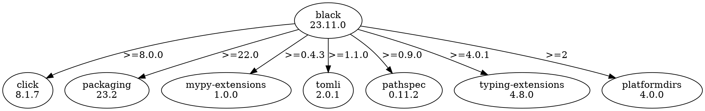

```yaml
number: 443
title: " Add graphviz output to puffin-dev resolve-cli"
type: pull_request
state: merged
author: konstin
labels:
  - internal
assignees: []
merged: true
base: main
head: graphviz
created_at: 2023-11-17T14:09:08Z
updated_at: 2023-11-17T18:16:25Z
url: https://github.com/astral-sh/uv/pull/443
synced_at: 2026-01-10T15:50:28Z
```

#  Add graphviz output to puffin-dev resolve-cli

---

_Pull request opened by @konstin on 2023-11-17 14:09_

 I added output in graphviz DOT format to `puffin-dev resolve-cli` to help with debugging resolutions. This requires tracking the requested ranges in the graph. I also fixed the direction of the graph.

 Output for `black`:




transformers:


jupyter:


---

_Review comment by @charliermarsh on `crates/puffin-resolver/src/resolution.rs`:55 on 2023-11-17 14:29_

Can we add a `From` for this and use `.into()` rather than making this public?

---

_@charliermarsh reviewed on 2023-11-17 14:30_

---

_@charliermarsh approved on 2023-11-17 14:30_

---

_Label `internal` added by @charliermarsh on 2023-11-17 14:30_

---

_Merged by @charliermarsh on 2023-11-17 18:16_

---

_Closed by @charliermarsh on 2023-11-17 18:16_

---

_Branch deleted on 2023-11-17 18:16_

---
