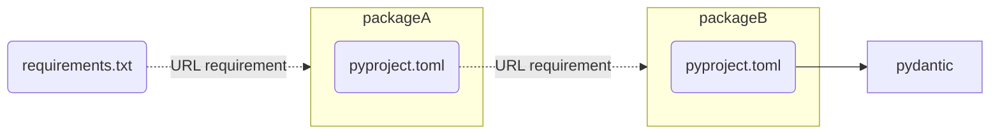

# Support URL requirements in transitive dependencies

---

_Issue opened by @acostapazo on 2024-02-21 13:48_

First of all, thank you for this awesome tool, its potential is enormous. 😄 

Platform: Ubuntu + MacOs
uv version: 0.1.6

I guess this issue is related with https://github.com/astral-sh/uv/issues/1603, but wasn't resolved in v0.1.16.
The error occurs when trying to install a package that in turn has a dependency that is installed via URL

For example, If we have a **requirement.txt** like the following to install a requirement with a URL.

**requirement.txt:**
```
packageA @ git+https://@github.com/alice-biometrics/uv-playground@main#egg=src&subdirectory=issues/url_deps/packageA
```

And the packageA also have a requirement to install another package (packageB) from URL.

**pyproject.toml (from package A)**
```toml
..
dependencies = [
    "packageB @ git+https://@github.com/alice-biometrics/uv-playground@main#egg=src&subdirectory=issues/url_deps/packageB"
]
...
```



When I try to install it with my **requirements.txt** with uv (v0.1.16) i'm obtaining the following error:

```console
 > uv pip install -r requirements.txt
  Updated https://github.com/alice-biometrics/uv-playground (961d0e8)                                                                                                            
  error: Package `packageb` attempted to resolve via URL: git+https://github.com/alice-biometrics/uv- 
  playground@main#egg=src&subdirectory=issues/url_deps/packageB. URL dependencies must be expressed as direct 
  requirements or constraints. Consider adding `packageb @ git+https://github.com/alice-biometrics/uv- 
  playground@main#egg=src&subdirectory=issues/url_deps/packageB` to your dependencies or constraints file.
```

Currently, it appears that `uv` is encountering difficulty resolving inherited dependencies (such as packageB) from URLs specified in the dependencies section of pyproject.toml for packageA. I've provided a reproducible example in the following repository: [uv-playground](https://github.com/alice-biometrics/uv-playground/tree/main/issues/url_deps).

When packageB is included directly in the main requirement.txt, `uv` successfully resolves the dependency. However, I believe `uv` should automatically resolve inherited dependencies from dependent packages, irrespective of whether they are specified by URL or not, similar to the behavior of pip.

**pip example:**
```
 pip install -r requirements.txt   
Collecting packageA@ git+https://****@github.com/alice-biometrics/uv-playground@main#egg=src&subdirectory=issues/url_deps/packageA (from -r requirements.txt (line 1))
  Cloning https://****@github.com/alice-biometrics/uv-playground (to revision main) to /private/var/folders/q6/x7kmvkj1007_pzt6qlcp0yg80000gn/T/pip-install-884jgrjp/packagea_8bc58740c10d4bc8aeaac2793fed3350
  Running command git clone --filter=blob:none --quiet 'https://****@github.com/alice-biometrics/uv-playground' /private/var/folders/q6/x7kmvkj1007_pzt6qlcp0yg80000gn/T/pip-install-884jgrjp/packagea_8bc58740c10d4bc8aeaac2793fed3350
  Resolved https://****@github.com/alice-biometrics/uv-playground to commit 961d0e851f95831440e39af1fbfb65232fc8bad2
  Installing build dependencies ... done
  Getting requirements to build wheel ... done
  Preparing metadata (pyproject.toml) ... done
Collecting packageB@ git+https://****@github.com/alice-biometrics/uv-playground@main#egg=src&subdirectory=issues/url_deps/packageB (from packageA@ git+https://@github.com/alice-biometrics/uv-playground@main#egg=src&subdirectory=issues/url_deps/packageA->-r requirements.txt (line 1))
  Cloning https://****@github.com/alice-biometrics/uv-playground (to revision main) to /private/var/folders/q6/x7kmvkj1007_pzt6qlcp0yg80000gn/T/pip-install-884jgrjp/packageb_1edf5d1949014c61b524fb3b3adab146
  Running command git clone --filter=blob:none --quiet 'https://****@github.com/alice-biometrics/uv-playground' /private/var/folders/q6/x7kmvkj1007_pzt6qlcp0yg80000gn/T/pip-install-884jgrjp/packageb_1edf5d1949014c61b524fb3b3adab146
  Resolved https://****@github.com/alice-biometrics/uv-playground to commit 961d0e851f95831440e39af1fbfb65232fc8bad2
  Installing build dependencies ... done
  Getting requirements to build wheel ... done
  Preparing metadata (pyproject.toml) ... done
Requirement already satisfied: pydantic in /Library/Frameworks/Python.framework/Versions/3.9/lib/python3.9/site-packages (from packageB@ git+https://@github.com/alice-biometrics/uv-playground@main#egg=src&subdirectory=issues/url_deps/packageB->packageA@ git+https://@github.com/alice-biometrics/uv-playground@main#egg=src&subdirectory=issues/url_deps/packageA->-r requirements.txt (line 1)) (2.6.1)
Requirement already satisfied: annotated-types>=0.4.0 in /Library/Frameworks/Python.framework/Versions/3.9/lib/python3.9/site-packages (from pydantic->packageB@ git+https://@github.com/alice-biometrics/uv-playground@main#egg=src&subdirectory=issues/url_deps/packageB->packageA@ git+https://@github.com/alice-biometrics/uv-playground@main#egg=src&subdirectory=issues/url_deps/packageA->-r requirements.txt (line 1)) (0.6.0)
Requirement already satisfied: pydantic-core==2.16.2 in /Library/Frameworks/Python.framework/Versions/3.9/lib/python3.9/site-packages (from pydantic->packageB@ git+https://@github.com/alice-biometrics/uv-playground@main#egg=src&subdirectory=issues/url_deps/packageB->packageA@ git+https://@github.com/alice-biometrics/uv-playground@main#egg=src&subdirectory=issues/url_deps/packageA->-r requirements.txt (line 1)) (2.16.2)
Requirement already satisfied: typing-extensions>=4.6.1 in /Library/Frameworks/Python.framework/Versions/3.9/lib/python3.9/site-packages (from pydantic->packageB@ git+https://@github.com/alice-biometrics/uv-playground@main#egg=src&subdirectory=issues/url_deps/packageB->packageA@ git+https://@github.com/alice-biometrics/uv-playground@main#egg=src&subdirectory=issues/url_deps/packageA->-r requirements.txt (line 1)) (4.9.0)
Building wheels for collected packages: packageA, packageB
  Building wheel for packageA (pyproject.toml) ... done
  Created wheel for packageA: filename=packageA-0.0.1-py3-none-any.whl size=1493 sha256=f0ac5e361fb53cbfb15361ef254b464aaecb077344a05426f31421afca0bab5e
  Stored in directory: /private/var/folders/q6/x7kmvkj1007_pzt6qlcp0yg80000gn/T/pip-ephem-wheel-cache-q3cf5kxx/wheels/08/bc/d8/e4f479525c376157200e945e40044746e83c025ad0f2d4c467
  Building wheel for packageB (pyproject.toml) ... done
  Created wheel for packageB: filename=packageB-0.0.1-py3-none-any.whl size=1432 sha256=8e04951b1a21171b7fa94b02093832015549d140e9459ca63178f6f919a9d0ae
  Stored in directory: /private/var/folders/q6/x7kmvkj1007_pzt6qlcp0yg80000gn/T/pip-ephem-wheel-cache-q3cf5kxx/wheels/7c/68/71/46e6369994133bcdbc3af801707a51981374abc5de0d7dc830
Successfully built packageA packageB
Installing collected packages: packageB, packageA
Successfully installed packageA-0.0.1 packageB-0.0.1
```

This issue impacts the ease of managing dependencies and could streamline the workflow significantly if resolved. Thank you for your attention to this matter.


---

_Renamed from "Cannot install the requirement of my requirements via URL. URL dependencies must be expressed as direct requirements or constraints." to "Unable to resolve and install the requirements of required package through URL. URL dependencies must be expressed as direct requirements or constraints." by @acostapazo on 2024-02-22 07:53_

---

_Renamed from "Unable to resolve and install the requirements of required package through URL. URL dependencies must be expressed as direct requirements or constraints." to "Dependency Resolution Issue: Failure to Install Inherited Required Package via URL. URL dependencies must be expressed as direct requirements or constraints." by @acostapazo on 2024-02-22 08:01_

---

_Comment by @acostapazo on 2024-02-22 14:29_

Same error on ` v0.1.7`

---

_Comment by @acostapazo on 2024-02-22 14:49_

I'm not sure, but this behaivor seems to be something by design as you explain at https://github.com/astral-sh/uv/issues/1853.

As @SnoopJ commented, this could be a stopper to our immediate adoption. A flag option would be very nice!


---

_Comment by @dcaro21 on 2024-02-23 11:58_

Note that this problem also affects `uv pip compile`.

One of our transitive dependencies is defined as `git+https`, which is not ideal but that's life, we don't really want to add it to our requirements because it's an unnecessary burden when updating the root package.
This makes `uv` impossible to use in our project.

Please, consider maintaining this behavior opt-in but having a flag to opt-out of it, otherwise this will be a complete stopper for some use cases.

---

_Comment by @JacobCallahan on 2024-03-01 14:07_

This is also going to be a blocker for a lot of people/teams. If there was a way to disable this check, and perhaps others that pip just deals with, that would be a huge plus for bringing this into more teams.

---

_Renamed from "Dependency Resolution Issue: Failure to Install Inherited Required Package via URL. URL dependencies must be expressed as direct requirements or constraints." to "Support URL requirements in transitive dependencies" by @charliermarsh on 2024-03-04 00:13_

---

_Referenced in [astral-sh/uv#1932](../../astral-sh/uv/issues/1932.md) on 2024-03-04 00:13_

---

_Referenced in [astral-sh/uv#2239](../../astral-sh/uv/issues/2239.md) on 2024-03-06 13:50_

---

_Label `enhancement` added by @charliermarsh on 2024-03-08 20:57_

---

_Comment by @timothyjlaurent on 2024-03-14 17:52_

I'm seeing this with transitive editable dependencies

```
error: Package `file-utils` attempted to resolve via URL: file:///some/path/file_utils. URL dependencies must be expressed as direct requirements or constraints.
```

---

_Comment by @charliermarsh on 2024-03-14 18:00_

Are transitive editable dependencies possible? How are your dependencies defined?

---

_Comment by @timothyjlaurent on 2024-03-15 19:47_

Hi @charliermarsh thanks for the response. 

We're currently using poetry with editable dependencies for our monorepo

eg

```
[tool.poetry.dependencies]
lib1 = {path = "../../lib/lib1", develop = true }
```

Since any package can have dependencies on others we can have lib1 in this example having dependencies on lib2.

I understand that uv doesn't support poetry dependencies (yet), but we're able to `pip install /path/to/a/package` and it will install properly (though not respect the pinned deps in the lockfile).

What I'm noticing is that if I `uv pip install .` it complains not about the first line of deps, but about the second, eg lib2 in this toy example.

---

_Referenced in [astral-sh/uv#2511](../../astral-sh/uv/issues/2511.md) on 2024-03-18 15:48_

---

_Referenced in [astral-sh/uv#2635](../../astral-sh/uv/issues/2635.md) on 2024-03-25 18:50_

---

_Referenced in [astral-sh/uv#2684](../../astral-sh/uv/pulls/2684.md) on 2024-03-27 04:02_

---

_Comment by @charliermarsh on 2024-04-01 21:15_

The next version of uv will support transitive URL dependencies.

---

_Closed by @charliermarsh on 2024-04-01 21:16_

---

_Comment by @ncoish on 2024-08-30 23:12_

Is this still an issue on `uv 0.4.1`? I have a transitive dependency on `jaxlib` which is causing the following error:
```
error: Package `jaxlib` attempted to resolve via URL: https://storage.googleapis.com/jax-releases/cuda12/jaxlib-0.4.14+cuda12.cudnn89-cp311-cp311-manylinux2014_x86_64.whl. URL dependencies must be expressed as direct requirements or constraints. Consider adding `jaxlib @ https://storage.googleapis.com/jax-releases/cuda12/jaxlib-0.4.14+cuda12.cudnn89-cp311-cp311-manylinux2014_x86_64.whl` to your dependencies or constraints file.
```


---

_Comment by @CandiedCode on 2024-09-03 23:30_

I'm seeing this as well with the latest `uv` 
>Package `torch` attempted to resolve via URL: https://download.pytorch.org/whl/cpu/torch-2.4.0%2Bcpu-cp39-cp39-linux_x86_64.whl. URL dependencies must be expressed as direct requirements or constraints. Consider adding `torch @ [https://download.pytorch.org/whl/cpu/torch-2.4.0%2Bcpu-cp39-cp39-linux_x86_64.whl`](https://download.pytorch.org/whl/cpu/torch-2.4.0%2Bcpu-cp39-cp39-linux_x86_64.whl%60) to your dependencies or constraints file.

---

_Comment by @charliermarsh on 2024-09-03 23:32_

We don't support registry requirements that themselves depend on URL requirements.

---

_Comment by @mansenfranzen on 2024-09-05 12:40_

First of all, thanks a lot for all the great work you put into uv and ruff! Really appreciating how you improve developer experience in the python ecosystem.

Now to my question: is it intended to support URL requirements in transitive dependencies at some point in the future? 

In my example, I have a dummy python package named `foo` that has a single URL dependency. The `pyproject.toml` looks like this:

```yaml
[tool.poetry.dependencies]
pywrangler = { tag = "v0.1.1",  git = "https://github.com/mansenfranzen/pywrangler.git" }
```

When I install foo's wheel from a private index via `uv pip install foo`  I get the following error (running uv 0.4.5): 

```
`Package `pywrangler` attempted to resolve via URL: git+https://github.com/mansenfranzen/pywrangler.git@v0.1.1. URL dependencies must be expressed as direct requirements or constraints. Consider adding `pywrangler @ git+https://github.com/mansenfranzen/pywrangler.git@v0.1.1` to your dependencies or constraints file.`
```

To be honest, I'm bit confused about what is currently supported or not. The [documentation](https://docs.astral.sh/uv/pip/compatibility/#transitive-direct-url-dependencies-for-constraints-and-overrides) makes clear that transitive URL deps aren't supported while @charliermarsh comments from April 1st mention otherwise. 

---

_Comment by @WitoldDankiewicz on 2024-10-04 10:54_

My team is facing same issue. Is there any update on that?

---

_Comment by @slochower on 2024-10-10 04:31_

> To be honest, I'm bit confused about what is currently supported or not. The [documentation](https://docs.astral.sh/uv/pip/compatibility/#transitive-direct-url-dependencies-for-constraints-and-overrides) makes clear that transitive URL deps aren't supported while @charliermarsh comments from April 1st mention otherwise.

I am also confused by the documentation for transitive dependencies. The docs say:

> If uv rejects a transitive URL dependency in either case, the best course of action is to provide the URL dependency as a direct dependency in the requirements.in file, rather than as a constraint, override, or transitive dependency.

I interpreted this to mean that it is possible to install a package that has a dependency with a URL dependency (e.g. trying to install `A` from a repository that depends (non-URL) on `B` that has a URL dependency) by manually including the URL dependency in the `requirements.in` file alongside package `A`. But this does not work. So it's not clear to me if there is *any* way to install package `A` in this scenario.

---

_Comment by @charliermarsh on 2024-10-10 09:45_

URL dependencies of URL dependencies are supported! But the following are not:

1. URL dependencies of _registry_ dependencies (i.e., a package on PyPI that itself depends on a URL dependency -- PyPI does not allow this anyway but your own custom registry might permit it).
2. URL dependencies of URL-based _constraints_ (`--constraint`) or _overrides_ (`--override`).

The second is very rare but it's mentioned in the docs because it _is_ possible for us to miss transitive URL dependencies if you provide the originating URL via a constraint or override. The documentation is intentionally nuanced for this reason but I can make it clearer.

---

_Referenced in [astral-sh/uv#8080](../../astral-sh/uv/issues/8080.md) on 2024-10-10 09:51_

---

_Comment by @charliermarsh on 2024-10-10 09:54_

Created an issue to track that at: https://github.com/astral-sh/uv/issues/8080

---

_Comment by @mansenfranzen on 2024-10-10 10:09_

@charliermarsh Thanks a lot for clarifying! I'm struggling to understand the reasoning behind forbidding transitive URL dependencies for *registry* dependencies. Unfortunately, I couldn't find any documentation in related issues or docs regarding this conceptual design. Do you happen to have some further information on this?

---

_Comment by @charliermarsh on 2024-10-10 10:20_

The most succinct explanation I can give is that we need to know the set of URLs upfront in order to fit them into the design of the resolver algorithm. So we recursively traverse any direct URL dependencies, resolving their own direct URL dependencies, etc. We can't do the same for registry dependencies, since we can't know what versions will be selected upfront and from which registry (unlike direct URLs, which tell us exactly where to find them).

---

_Comment by @charliermarsh on 2024-10-10 10:21_

I think we're relatively unlikely to support it. Are you depending on that behavior?

---

_Comment by @mansenfranzen on 2024-10-10 10:51_

Thanks for your explanation. The rationale around the resolver algorithm helps me to get an intuition.

I don't strictly depend on this feature. We have a "good-enough-workaround" to convert the URL dependency into a proper *registry* dependency. 

---

_Comment by @slochower on 2024-10-10 19:02_

> URL dependencies of URL dependencies are supported! But the following are not:
> URL dependencies of registry dependencies (i.e., a package on PyPI that itself depends on a URL dependency -- PyPI does not allow this anyway but your own custom registry might permit it).

Thanks @charliermarsh, this is more clear than the (current) documentation and a helpful clarification (and does describe the situation I'm facing)!

> We have a "good-enough-workaround" to convert the URL dependency into a proper registry dependency.

@mansenfranzen does your workaround cover the case of URL dependencies in a registry package? I'm not sure there is any way to handle this with `uv`, aside from creating a local fork of the registry package and manually changing the dependencies?

---

_Referenced in [astral-sh/uv#11179](../../astral-sh/uv/issues/11179.md) on 2025-02-04 09:23_

---
